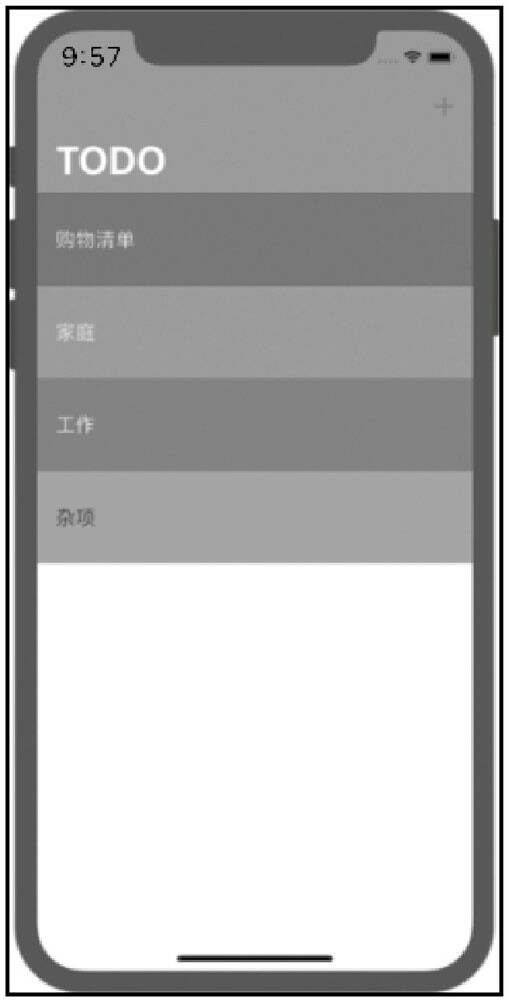
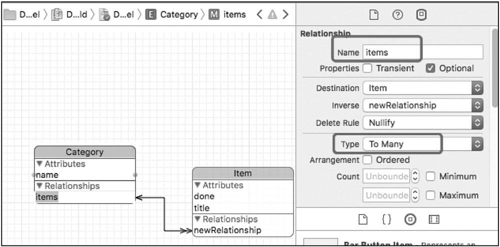

## 第13章 使用Core Data、User Defaults学习本地数据存储

本章带领大家制作一款类TODO List的App。它的灵感来源于我们经常使用的TODO类应用程序，如图13-1所示。  

  
图13-1 TODO应用的运行界面  

该应用允许我们创建一个新的事务列表，比如可以创建一个购物清单的任务列表，然后通过一个特殊的颜色区别于其他的事务列表。你可以选择其中的一个列表，然后在这个指定的列表中添加要做的事项条目。在添加了一些事项以后，你会发现这个事项列表会呈现出一个非常漂亮的从浅至深的渐变色，如图13-2所示。

  

图13-2 事项列表中的渐变色  

图13-2所示就是我们所添加的事项条目，你可以勾选这些条目，代表该任务已经完成，也可以通过向左滑动将它们删除。除此以外，你还可以在事务列表中搜索关键字，比如我们可以搜索"苹果"关键字，然后单击搜索，这样就可以看到在列表中会列出包含"苹果"的相关条目。最神奇的地方在于，应用中所有的数据都被保存到了模拟器本地，或者是iPhone的物理真机上面。这也就意味着如果你在设备上关闭了应用，或者是升级了该应用，或者是升级了iOS的版本，或者是换了一部新手机，所有的数据还会储存在你的设备上。如果你单击购物清单事务的话，仍然可以看到里边存储的条目。这就是本章我们要完成的任务。

本章我们会使用不同的方式去处理本地的数据，包括使用default存储少量的数据。另外，还可以使用Core Data存储大批量的数据。Core Data就像我们所使用的数据库。在本应用中，我们将会创建一个关系型数据库——Realm，并以该数据库作为后台。最后，我们还会编写一些前端代码，让我们的应用程序看起来更加漂亮。

## 13.1 创建UITableViewController的子类

首先，我们需要创建一个Single View App，将Product Name设置为TODO，这里确保Use Core Data处于未勾选的状态，当我们在后面需要使用到Core Data的时候会手动添加该功能。因为在项目之初，所以我们还是要尽可能保持项目架构的精简、整洁和清晰。

另外，在保存项目之前请确保勾选Create Git repository on my Mac，因为在本章我们将会使用不同的方法去连接本地数据。有的时候，我们会在实现了数据连接功能以后再回滚到之前的版本，去对比两种方法的不同。

在创建好新的项目以后，首先我们要在项目设置中取消Deveice Orientation中的Landscape Left和Landscape Right勾选状态，因为我们只想让应用纵向显示。

接下来，我们就要在项目中通过一种全新的方式来创建表格视图控制器。

- 实战：在项目中创建表格视图控制器。

步骤1：在故事板中，从对象库里面拖曳一个新的表格视图控制器(Table View Controller) 。迄今为止，我们一直在使用标准的视图控制器(View Controller) ，这两个控制器从外观上来说还是有很多不同的。如图13-3所示，表格视图控制器自带有一个表格视图、一个Prototype单元格及所有的委托协议。  
  
图13-3 对象库中的表格视图控制器  

步骤2：在故事板中将之前指向视图控制器的箭头拖曳到表格视图控制器。箭头指向的控制器代表初始视图控制器(initial view controller) ，也就意味着一旦应用启动，该控制器的视图就会呈现到屏幕上，如图13-4所示。
  
图13-4 将表格视图控制器设置为初始控制器  

在调整好初始控制器以后，删除之前项目模板所生成的视图控制器。
如果在删除前忘记调整初始箭头，则可以选中表格视图控制器，然后在Attributes Inspector中勾选View Controller部分中的Is Initial View Controller，如图13-5所示。  
  
图13-5 在Attributes Inspector中设置初始控制器  

此时你会发现，目前在故事板中的表格视图控制器并没有连接到项目中的ViewController.swift文件，因为该文件是与之前故事板中被删除的控制器关联的。接下来，我们要将该文件修改为符合表格视图控制器的类文件。

步骤3：在项目导航中打开ViewController.swift文件，修改ViewController类的声明。为了更加明确，先将类名称修改为TodoListViewController。需要注意的是，这里将其父类修改为UITableViewController，代表该类的父类是UITableViewController。  
```swift
class TodoListViewController: UITableViewController {
```
然后，在项目导航中，将ViewController.swift文件名修改为TodoListViewController. swift。

步骤4：回到故事板中，选中表格视图控制器后在Identifier Inspector中将Class设置为TodoListViewController，此时故事板中的用户界面与TodoListViewController代码类建立关联。
此时Xcode有一个警告错误：Prototype table cells must have reuse identifiers。我们需要为表格视图单元格指定一个标识。

步骤5：选中Prototype Cell，在Attributes Inspector中将Identifier设置为ToDoItemCell，警告消失。

- 提示

如果在故事板中不方便选中Prototype Cell对象，则可以借助大纲导览视图(Document Outline) 中的列表项选取表格视图中的单元格。

接下来，让我们对用户界面做一些修改。

- 实战：修改用户界面。

步骤1：故事板中选中表格控制器视图，菜单中选择Editor/Embed In/Navigation Controller，让其成为导航控制器中的根控制器。

步骤2：选中表格视图控制器顶部的导航栏(Navigation Item)，在Attributes Inspector中将其Title设置为TODO，如图13-6所示。
  
图13-6 修改导航控制器的Title属性  

步骤3：选中导航控制器视图顶部的导航栏，在Attributes Inspector中将Bar Tint颜色修改为蓝色。再将Title Color设置为白色，如图13-7所示。
  
图13-7 修改导航栏的Bar Tint属性  

接下来，我们要设置与表格视图控制器相关的代码。因为在故事板中我们从对象库直接创建了表格视图控制器，在代码类中直接设置ToDoListViewController为UITableViewController的子类，所以我们就不用像之前那样单独声明UITableViewDelegate和UITableViewDataSource协议，以及建立与表格视图的IBOutlet关联了。  

- 实战：设置TodoListViewController类中的代码。

步骤1：在TodoListViewController中创建itemArray数组。
```swift
let itemArray = ["购买水杯", "吃药", "修改密码"]
```
显然，我们利用该数组临时呈现一些事务列表项。  

步骤2：为表格视图创建两个Table View DataSource方法，一个用于返回要显示的单元格对象，另一个则用于显示表格视图有多少行。  
```swift
//MARK: - Table View DataSource methods
override  func  tableView(_  tableView:  UITableView,  cellForRowAt  indexPath:IndexPath) -> UITableViewCell {
  let  cell  =  tableView.dequeueReusableCell(withIdentifier:  "ToDoItemCell",  for:indexPath)
  cell.textLabel? .text = itemArray[indexPath.row]

  return cell
}

override func tableView(_ tableView: UITableView, numberOfRowsInSection section:Int) -> Int {
  return itemArray.count
}
```  

在cellForRowAt() 方法中，我们首先从表格视图中获取一个可复用的单元格对象，这个单元格的标识为ToDoItemCell，其是和之前在故事板中为Prototype Cell设置的标识一样的单元格。之后设置textLabel的text为数组中相应的元素内容，textLabel是每个单元格对象都会有的内置Label。  

在numberOfRowsInSection() 方法中，直接返回itemArray数组的元素个数作为单元格的数量。
构建并运行项目，效果如图13-8所示。  
  
图13-8 在单元格中显示自定义好的事项  

接下来，我们将要实现的是：当用户单击单元格以后，要在调试控制台打印出该单元格的信息，并且当用户单击单元格的时候还可以呈现一个勾选标记。这些功能需要我们实现UITableViewDelegate协议中的方法。

步骤1：在ToDoListViewController类中实现下面的方法。  
```swift
//MARK: - Table View Delegate methods
override  func  tableView(_  tableView:  UITableView,  didSelectRowAt  indexPath:IndexPath) {
  print(indexPath.row)
}
```

该方法用于告诉控制器用户单击了表格视图中的哪个单元格，我们通过indexPath参数得到该信息。
构建并运行项目，如果单击了第一个单元格，则控制台会显示0。如果想要打印单元格中的内容，因为它与itemArray数组中的元素一致，所以只需要将打印语句修改为print(itemArray[indexPath.row]) 即可。

目前，当用户单击单元格以后，被选中的单元格就会呈现灰色的高亮状态。我们需要换一种呈现方式。  

步骤2：在tableView:didSelectRowAt：方法中添加下面的代码。
```swift
override  func  tableView(_  tableView:  UITableView,  didSelectRowAt  indexPath:IndexPath) {
  print(itemArray[indexPath.row])

  tableView.deselectRow(at: indexPath, animated: true)
}  
 ```  
构建并运行项目，在用户单击单元格以后灰色高亮会逐渐变淡消失，看起来是一个非常不错的用户体验。

接下来，我们要实现的是在单元格中呈现勾选标记，这需要使用一个名为accessory的属性。

步骤3：在故事板中，通过大纲导览视图选中ToDoItemCell，然后在Attributes Inspector中将Accessory设置为Checkmark，此时你会发现单元格的右侧会出现一个勾选标记。我们还是将它设置为默认状态None，如图13-9所示。    
  
图13-9 设置表格视图单元格的Accessory属性  
  
步骤4：继续修改tableView: didSelectRowAt：方法中的代码。  
```swift
override func tableView(_ tableView: UITableView, didSelectRowAt indexPath:IndexPath) {
  tableView.cellForRow(at: indexPath)? .accessoryType = .checkmark
  tableView.deselectRow(at: indexPath, animated: true)
}
```
其中，cellForRow(at indexPath: IndexPath) 方法会通过indexPath参数获取到表格视图中指定单元格对象。然后再通过该单元格对象的accessoryType属性设置其属性值为.checkmark。

如果此时构建并运行项目，当用户单击单元格后确实会出现勾选标记，但是当再次单击的时候却不会有任何变化。所以我们需要借助if语句，进行勾选状态的切换。  
```swift
override func tableView(_ tableView: UITableView, didSelectRowAt indexPath:IndexPath) {
  if tableView.cellForRow(at: indexPath)?.accessoryType == .checkmark {
    tableView.cellForRow(at: indexPath)?.accessoryType = .none
  }else {
    tableView.cellForRow(at: indexPath)?.accessoryType = .checkmark
  }

  tableView.deselectRow(at: indexPath, animated: true)
}
```

构建并运行项目，我们可以任意切换单元格的选中状态，如图13-10所示。  

  
图13-10 完成单元格的勾选效果  

## 13.2 在UIAlert中使用文本框创建新的条目

在我们进行接下来的实战练习之前，最好先提交当前的项目到远程仓库里面。  

- 实战：提交项目到GitHub。  

步骤1：在代码控制导航中，在顶部的TODO条目单击鼠标右键，在快捷菜单中选择Create "TODO" Remote on GitHub。在弹出的面板中设置Repository Name为TODO，设置Remote Name为origin，最后单击Create按钮，如图13-11所示。  
  
  
图13-11 在GitHub账号中创建一个新的仓库  

步骤2：在菜单中选择Source Control/Commit...，可以发现此时我们修改了项目中不少的文件。将提交信息设置为"TODOListViewController完成datasource和delegate方法"，并勾选Push to remote:origin/master，单击Commit 4 Files按钮，如图13-12所示。  

  
图13-12 将修改提交到GitHub上面  

此时，在Branches的master分支中，我们可以看到两个提交：Initial Commit和刚才的一次提交。我们在之后的操作中可以回滚到这两个提交时候的状态。  

现在让我们回到TodoListViewController.swift文件，此时需要为它添加一些功能。  

步骤3：为了可以在表格中继续添加条目，首先需要为应用添加一个按钮。最简单的方式就是从对象库拖曳一个Bar Button Item，再将它放置到ToDoListViewController视图中导航栏的右侧。  

步骤4：选中Bar Button Item，然后在Attributes Inspector中将System Item设置为Add，此时该按钮会变成+号。再将Tint属性修改为白色，让其颜色与Title保持一致。  

步骤5：为该按钮创建一个IBAction连接，方法名称为addButtonPressed。  
```
//MARK: - Add New Items
@IBAction func addButtonPressed(_ sender: UIBarButtonItem) {
  let alert = UIAlertController(title: "添加一个新的ToDo项目", message: "",preferredStyle: .alert)

  let action = UIAlertAction(title: "添加项目", style: .default) { (action) in
    // 用户单击添加项目按钮以后要执行的代码
    print("成功！")
  }

  alert.addAction(action)
  present(alert, animated: true, completion: nil)
}
```  
当用户单击+按钮以后，会执行addButtonPressed(_ sender: UIBarButtonItem) 方法。在该方法中，我们会创建一个UIAlertController类型的对象，并设置警告对话框的标题为"添加一个新的ToDo项目"，风格为.alert类型，如图13-13所示。UIAlertController警告对话框一共有两种风格：Alert和ActionSheet。第一种风格会出现在屏幕的中央位置，第二种则会从屏幕底部滑出。  

    
图13-13 警告对话框的两种风格   

在addButtonPressed(_ sender: UIBarButtonItem) 方法中，我们接着创建了UIAlertAction类型的对象，它会在对话框中呈现一个用户可以单击的按钮，一旦用户填写了新的条目信息，就可以单击该按钮。这里设置按钮的风格为default，在单击按钮以后会执行方法中的handler闭包，这里带有一个参数，就是用户单击的这个UIAlertAction对象。在闭包中我们先简单打印一个"成功！"信息到控制台。  

后面的代码会将所创建的UIAlertAction对象添加到UIAlertController对话框之中，最后通过present() 方法将警告对话框显示到屏幕上。

构建并运行项目，在单击+号以后，可以看到一个警告对话框出现在屏幕上面。当单击添加项目按钮以后，控制台会显示"成功！"信息，如图13-14所示。  

  
图13-14 警告对话框的运行效果  

接下来，我们需要让警告对话框中呈现一个文本框，这样用户才能够输入新的事务项目。当然在用户单击添加项目按钮以后，会在控制台打印事务项目信息。  

- 实战：在警告对话框中添加文本框。  

步骤1：在addButtonPressed(_ sender: UIBarButtonItem) 方法中添加下面的代码。  
```swift
@IBAction func addButtonPressed(_ sender: UIBarButtonItem) {

  ……
  alert.addTextField { (alertTextField) in
    alertTextField.placeholder = "创建一个新项目..."
    print(alertTextField.text! )
  }

  alert.addAction(action)
  present(alert, animated: true, completion: nil)
}
```  

我们通过UIAlertController的addTextField() 方法在对话框中添加了一个文本框，完成闭包的参数代表所创建的文本框对象，在闭包中设置了文本框的placeholder属性，并且在用户单击按钮以后，还会将用户所输入的事务名称打印到控制台。
构建并运行项目，经过测试我们发现，所填写的事务信息并没有打印到控制台。这是因为在用户单击按钮以后只调用了UIAlertAction的闭包，因此就不会再执行addTextField() 的闭包了。该闭包的代码在之前向对话框中添加文本框的时候已经被执行了。  

这时，我们需要在方法中声明一个变量，用于存储alertTextField对象，这样在UIAlertAction闭包中就可以随时访问它了。  

步骤2：修改addButtonPressed(_ sender: UIBarButtonItem) 方法，通过在方法内部声明一个变量，在UIAlertAction的闭包中就可以访问对话框中的文本框对象。  
```swift
@IBAction func addButtonPressed(_ sender: UIBarButtonItem) {

  // 声明一个新的变量，生存期在方法的内部
  var textField = UITextField()

  let alert = UIAlertController(title: "添加一个新的ToDo项目", message:"",preferredStyle: .alert)

  let action = UIAlertAction(title: "添加项目", style: .default) { (action) in
    // 当用户单击添加项目按钮以后要执行的代码
    print(textField.text! )
  }

  alert.addTextField { (alertTextField) in
    alertTextField.placeholder = "创建一个新项目..."
    // 让textField指向alertTextField，因为出了闭包，alertTextField不存在
    textField = alertTextField
  }

  alert.addAction(action)
  present(alert, animated: true, completion: nil)
}
```

构建并运行项目，在单击按钮以后，文本框内用户所输入信息被打印到控制台中，如图13-15所示。   

  
图13-15 通过闭包实现对文本框的操作  

接下来，我们需要将文本框中的数据添加到itemArray数组之中。

步骤3：为了可以将数据添加到itemArray数组之中，将itemArray常量修改为变量var itemArray = ["购买水杯", "吃药", "修改密码"]。  

步骤4：在UIAlertAction的闭包中，修改代码如下：  
```swift
let action = UIAlertAction(title: "添加项目", style: .default) { (action) in
  // 当用户单击添加项目按钮以后要执行的代码
  self.itemArray.append(textField.text! )
  self.tableView.reloadData()
}
```  
这里，我们将文本框中的数据添加到itemArray数组之中。除此以外，还要通过表格视图的reloadData() 方法让其重新载入数据来更新表格视图中所显示的数据，如图13-16所示。  

  
图13-16 将新添加的事务添加到数组之中

在完成了添加新项目到表格视图以后，我们再次提交项目到远程仓库中。设置提交信息为"添加项目功能完成！"，注意一定要勾选Push to remote:origin/master，如图13-17所示。  

  
图13-17 提交修改到GitHub  

## 13.3 持续本地数据存储

### 13.3.1 为什么需要持续的本地数据存储

在之前的实战练习中，我们实现了添加事务项目的功能。但是当我们的应用在退出以后，就会出现一个Bug。  

我们先来看一下AppDelegate.swift文件，当应用在运行中出现系统级事件的时候就会调用AppDelegate类中的委托方法。
首先找到didFinishLaunchingWithOptions() 方法，当应用启动的时候会调用该方法。它的调用级别要高于初始(Initial) 视图控制器的viewDidLoad() 方法。

在didFinishLaunchingWithOptions() 方法中添加一行打印语句：print("didFinishLaunchi ngWithOptions") 。  

当应用在前台运行的时候，如果有电话打进来就会调用applicationWillResignActive() 方法。在用户选择接听电话后，我们可以在该方法中执行相关指令防止用户数据丢失。比如用户正在应用中填写表单的时候有电话打进来，我们可以在该方法中将数据保存到本地。  

在应用的界面从屏幕上消失的时候就会调用applicationDidEnterBackground() 方法。比如当用户按Home键，或者是打开了另一个不同的应用，这也就意味着我们的应用进入了后台。

在applicationDidEnterBackground() 方法中添加一行打印语句：print("applicationDidEn terBackground") 。  

还有一个非常重要的方法是applicationWillTerminate() ，当应用被用户或系统终止运行的时候就会调用该方法。在该方法中添加print("applicationWillTerminate") 语句。

让我们再次运行项目，观察AppDelegate中各种委托方法的执行顺序。当应用启动以后，在控制台首先会看到didFinishLaunchingWithOptions，该方法会在应用启动后的第一时间运行。当用户单击Home键回到主屏幕以后，在控制台会看到applicationDidEnterBackground。另外，当我们切换到另一个应用的时候也会看到该信息。最后，当系统需要回收宝贵的内存资源，或者是被用户强制退出的时候才会执行applicationWillTerminate() 方法。双击Home键，在iOS应用程序切换选择界面中将TODO项目向上划出屏幕以后，会在控制台看到applicationWillTerminate信息。

每一个应用都有其自己独特的生存期，从应用启动开始，它会出现在屏幕上，然后它可能会退到后台，直到最后资源回收，就像是我们人类的出生——生活——死亡的过程一样。

在我们清楚了上面这些委托方法都是做什么的以后，接下来看一下Bug是如何产生的。在模拟器中启动我们的TODO项目，在添加了一个新的事务项目以后，再将应用终止，你可以想到当再次回到应用的表格视图中时，之前所添加的事务就会消失，因为我们根本没有保存它。所以，这也是我们需要持续本地数据存储(persistent local data storage) 的原因。  

让应用终止运行的方法有很多，可以在应用切换界面中向上划出应用程序，如图13-18所示。另外，在更新应用或更新iOS系统的时候，在系统需要回收内存资源的时候都会终止应用程序的运行。  

  
图13-18 在模拟器中终止应用程序的运行  

### 13.3.2 使用UserDefaults实现持续本地数据存储的功能  

在iOS系统中，我们的应用都存在独立的沙箱(sandbox) 之中，如图13-19所示。原因是苹果为了确保设备的使用安全。这样可以防止恶意应用获取其他应用所存储的数据(比如网银数据) ，或者是试图去执行一些非法操作(安卓中的Root) 。  

  
图13-19 应用程序都存在于自己的安全沙箱之中  

对于你的应用来说，沙箱就像是一个小型的"监狱"。每个应用都拥有存储文件和文档的文件夹，它们可以随意读取自己的文件夹，但是绝对无法读取其他应用的文件或文档文件夹。

每次在你将iPhone的应用备份到Mac或者是iCloud云端的时候，应用中的Document文件夹总是会被备份。如果你购买了一个全新的iPhone，所存储到Document文件夹中的数据都不会被删除，这样就可以保证恢复到新iPhone的应用还保留有之前的数据。换句话说，如果将数据存储到应用的Document文件夹之中，不管是更换了iPhone，还是升级了iOS系统，还是升级了应用程序版本，你的私有数据还会安全的存在于iCloud云端或是本地的Mac电脑中。

沙箱不仅仅是让各个应用相互独立，也会让应用与iOS系统之间相互分离。我们不能恶意获取操作系统的安全数据，比如说用户的指纹数据或联系人信息等，这也是为什么iPhone比其他类型的手机更加安全。

当我们存储数据以及通过各种方法持续使用数据的时候，这些数据将会被保存到应用程序的容器内部，这样才能保证不会被其他的应用程序访问到，你也同样无法访问到其他应用的数据。

- 实战：使用UserDefaults存储本地数据。  

步骤1：在ToDoListViewController类中创建一个全新的UserDefaults类型的对象，它使用键/值配对的方式，在整个应用运行期间维持各种数据。
```swift
class TodoListViewController: UITableViewController {

  let defaults = UserDefaults.standard
  ……
```  

因为UserDefaults是单例模式，所以需要通过类方法standard获取该类的实例。

UserDefaults适合存储轻量级的本地客户端数据，它也有其局限性，但它非常易于使用，并且非常适合简单存储诸如字符串和数字之类的东西。比如记住密码功能，要保存一个系统的用户名、密码，UserDefaults是首选。下次再登录的时候就可以直接从UserDefaults里面读取用户上次登录的信息。

一般来说，本地存储数据还可以使用SQlite数据库，或者使用自己建立的plist文件等来存储，但是我们还需要亲自编写创建文件及读取文件的代码，比较麻烦。而使用UserDefaults则不用管这些东西，就像读字符串一样，直接读取就可以了。

UserDefaults支持的数据格式很多，有Int、Float、Double、BOOL、Array和Dictionary，甚至还包括Any类型。

步骤2：在UIAlertAction类的闭包中添加一行代码。
```swift
let action = UIAlertAction(title: "添加项目", style: .default) { (action) in
  // 当用户单击添加项目按钮以后要执行的代码
  self.itemArray.append(textField.text! )
  self.defaults.set(self.itemArray, forKey: "ToDoListArray")
  self.tableView.reloadData()
}
```

因为是在闭包之中，所以必须要使用self.表示调用的变量和方法都是在类中声明或创建的。通过set() 方法，将itemArray数组存储到UserDefaults中，与其对应的键名为ToDoListArray。

如果此时构建并运行项目，在添加一个新的事务以后，终止应用再重新开启它，表格中依然只会看到之前的三个事务。这是因为目前在代码中还没有让UserDefaults对象执行保存命令。只有在执行了保存命令以后，通过set() 方法所设置的键/值配对数据才会保存到一个plist格式的文件中。接下来，让我们找到这个文件的位置并看看它的存储格式。

步骤3：在AppDelegate类的didFinishLaunchingWithOptions() 方法中，通过下面的代码可以找出该应用在Mac操作系统中的实际位置。
```swift
func application(_ application: UIApplication,  
  didFinishLaunchingWithOptions launchOptions: [UIApplicationLaunchOptionsKey: Any]?) -> Bool {
  print(NSSearchPathForDirectoriesInDomains(.documentDirectory, .userDomainMask,true).last! as String)

  return true
}
```

iOS系统会为每一个应用程序生成一个私有目录，这个目录位于MacOS系统下iPhone模拟器文件夹内部，并会随机生成一个字符串作为目录名。在每一次应用程序启动时，这个字母数字串都不同于上一次。

我们可以通过上面的代码找到应用程序项目所使用的Documents目录，这个目录通常会作为数据持久化保存的位置。

因为应用是在沙箱(sandbox) 中的，在文件读写权限上会受到限制，因此只能在下面几个目录下读写文件：  
- Documents：应用中用户数据可以放在这里，iTunes备份和恢复的时候会包括此目录。
- tmp：存放临时文件，iTunes不会备份和恢复此目录，此目录下的文件可能会在应用退出后删除。
- Library/Caches：存放缓存文件，iTunes不会备份此目录，此目录下的文件不会在应用退出后被删除。

构建并运行项目，此时可以在控制台中看到类似下面的信息：
```
/Users/liuming/Library/Developer/CoreSimulator/Devices/7A08E65B-5457-4CB5-AEA6-064CDB120F6A/
data/Containers/Data/Application/D2722567-82A1-457C-B57E-7D1D9B9A008F/Documents
```  

此时，请再次添加一次拯救世界的事务项目，然后终止应用的运行。

步骤4：在Finder中通过菜单中的前往/前往文件夹...选项直接打开Documents文件夹，然后向上返回一级，也就是进入应用程序所在的文件夹，这里是D2722567-82A1-457C-B57E-7D1D9B9A008F。此时我们会看到四个文件夹：Documents、Library、SystemData和tmp，如图13-20所示。   

  
图13-20 应用程序在自己沙箱中的四个文件夹  

  
图13-53 应用程序在自己沙箱中的四个文件夹(iPhone真机调试)  

因为通过UserDefaults类存储的数据都会保存到Library/Preferences之中，所以我们可以进入该文件夹，你会发现里面有一个类似cn.l iuming.TODO.plist的文件。双击打开它以后会发现里面存储着四个事务项目。其中ToDoListArray就是在set() 方法中定义的键名，其内部包含了四个元素，如图13-21所示。   
 
  
图13-21 应用程序在自己沙箱中的四个文件夹  

为什么保存好的四个事务项目并没有出现在表格视图中？这是因为我们在应用启动以后还没有去主动获取UserDefaults的数据。  

步骤5：在TodoListViewController类的viewDidLoad() 方法中添加下面的代码。
```swift
override func viewDidLoad() {
  super.viewDidLoad()

  if let items = defaults.array(forKey: "ToDoListArray") as? [String] {
    itemArray = items
  }
}
```
    
如果从UserDefaults对象获取的数据是字符串数组，则通过可选绑定的方式赋值给items，然后在if语句内部将items赋值给itemArray数组。  

构建并运行项目，此时我们会看到表格视图中已经出现了四个事务项目，如果你愿意可以再添加一个项目，终止应用程序的运行以后再次将其打开，效果依旧。  

现在，我们需要再次提交修改后的项目到仓库。提交信息可以设置为"使用UserDefaults方法将数据保存到本地"。记住勾选Push to remote:origin/master。

### 13.3.3 UserDefaults说明

作为一名iOS开发者，你可能在项目中经常会用到UserDefaults，因为它使用起来非常简单、灵活，也不用写太多复杂的代码。接下来，让我们来看看UserDefaults还可以做什么。

在Playground中编写下面的这些代码。
```swift
let defaults = UserDefaults.standard
defaults.set(0.24, forKey: "Volume")
let volume = defaults.float(forKey: "Volume")
```
    
这里通过UserDefaults存储键名为Volume的单精度型的值0.24，最后再将其从UserDefaults中取出，并赋值给volume变量。  

除了可以定义单精度型的值外，我们还可以在UserDefaults中定义布尔型、字符串型和日期型的值，如图13-22所示。  

  
图13-22 在UserDefaults中存储不同基础类型的数据  

请注意，我们将一个日期型对象Date() 也存储到了UserDefaults之中，在获取它的时候，必须使用object() 方法，因为UserDefaults在存储它的时候是将它作为Any类型存储的。Any类型实际代表的就是任意的类型。  

接下来，让我们看看集合类型的操作。

```swift
let array = [1,2,3]
defaults.set(array, forKey: "myArray")
let dictionary = ["name": "Happy"]
defaults.set(dictionary, forKey: "myDictionary")

let myArray = defaults.array(forKey: "myArray")
let myDictionary = defaults.dictionary(forKey: "myDictionary")
```

其中，UserDefaults针对数组和字典有自己单独的方法array() 和dictionary() 。  

UserDefaults方式的存储非常灵活、简单，但是它只能存储几千字节的内容和简单的类型，对于大量的数据无法很好地管理，因为它毕竟不是数据库，也不能将它作为数据库来用，它只是一个简单的键/值配对的数据集，并以plist格式存储文件。  

如果你想要从UserDefaults中读取一条相关数据，则它会读取整个plist文件，再提供给你指定键的值。如果你的plist文件特别大，那么会花费太多的资源和时间。  

### 13.3.4 Swift中的单例模式

在整个UserDefaults的使用过程中，它的实例化非常特别，是通过UserDefaults. standard实例化一个UserDefaults对象实现的。类似的实例化方法还有URLSession.shared。通过这种方式进行实例化类的方式，我们称之为单例模式。  

什么是单例模式？它有什么特别的地方？单例模式的类，在整个应用程序的运行过程中只有一个实例对象，并且它可以通过共享的方式用在不同的类和对象之中。
让我们先创建一个Car类。
```swift
class Car {
  var colour = "Red"
}

let myCar = Car()
myCar.colour = "Black"

let yourCar = Car()
print(yourCar.colour)
```

在上面的代码中，Car类中有一个属性colour，它的默认值为Red。接下来我们创建了两个Car对象，不管我们如何修改myCar的colour属性值，yourCar的colour属性值都是Red，因为这是两个相互独立的对象。  

接下来让我们在另一个Playground文件中创建一个Car类。
```swift
class Car {
  var colour = "Red"

  static let singletonCar = Car()
}

let myCar = Car.singletonCar
myCar.colour = "Black"

let yourCar = Car.singletonCar
print(yourCar.colour)
```

从控制台中可以看到所打印的yourCar的colour值为Black，而且不管你通过Car. singletonCar创建多少个常量和变量，都会是同一个拷贝。也就是说，假如我们在某个类中修改了Car的colour属性值，那么其他类中的Car类型对象也会发生变化。  

实际上，UserDefaults达到的就是这样的效果，它本身就是一个单例。我们总是通过UserDefaults.standard创建一个实例对象，因此不管是在哪个类中通过该方法存储和读取数据，都会源自同一个plist文件，并且不会发生数据冲突的情况。  

### 13.3.5 创建自定义数据模型  

目前我们的应用程序看起来非常漂亮，但是这里面存在着一系列的Bug，只不过你还没有发现。  

让我们在itemArray数组里面添加多个项目，例如  
```swift
var itemArray = ["购买水杯", "吃药", "修改密码", "a", "b", "c", "d", "e", "f", "g", "h", "i", "j", "k", "l", "m","n", "o", "p"]
```  
，然后再将viewDidLoad() 方法中读取UserDefaults的数据到itemArray数组的代码注释掉。  

此时构建并运行项目，在模拟器中我们可以看到，所列出的项目已经超出了当前屏幕的范围，我们可以通过上下滚动表格视图浏览所有的项目。但是，当我们单击第一个单元格时，在它的右侧会出现一个勾选状态。如果再上下移动表格视图的话，你就会发现之前的勾选发生了错位。不管我们如何调整，总是有错位的情况出现，如图13-23所示。  

  
图13-23 部分单元格在勾选以后发生了错位的情况  

产生上述Bug的原因在于表格视图单元格的复用。当我们通过dequeueReusableCell() 方法获取一个可复用的单元格对象的时候，表格视图会去查找标识为ToDoItemCell的可以复用的单元格对象并启用它们。这也就意味着，当位于表格视图中第一个位置的单元格被向上滑出表格以后，它就不再可见，而且会被马上移到表格视图的底部，作为一个可以复用的单元格时刻准备从底部再次出现。当它再次出现的时候，之前的勾选状态并未被重置，所以带着之前那个单元格对象的状态又出现在了表格的底部。我们要如何避免这样的情况发生呢？  

这就需要我们在复用每一个单元格的时候，针对当前的数据检查它的勾选状态。当前的数据都是通过一个简单的数组提供的，从现在开始显然不能满足我们的需求了，我们需要创建一个全新的数据模型。

- 实战：创建数据模型。  

步骤1：在TODO文件夹中创建一个新的Group，名称为Data Model。在该组中创建一个新的Swift文件，名称为Item.swift。  

- 提示  

为了很好地区分Model、View和Controller，我们可以再创建一个Controllers、Views和Supporting Files，然后将相关文件拖曳到各组的内部，如图13-24所示。  

  
图13-24 调整项目的分组结构  

步骤2：在Item.swift文件中创建一个Item类。  
```swift
import Foundation

class Item {
  var title = ""
  var done = false
}
``` 
在Item类中，title是字符串类型用于存储事务的名称。done是布尔类型，用于指明是否完成了该事务，这里将它的初始值设置为false，代表该事务没有完成。  

步骤3：回到TodoListViewController.swift文件，首先将itemArray属性修改为
```swift
var itemArray = [Item]()
```
 ，然后修改viewDidLoad() 方法中的代码，修改后如下面的样子。
```swift
override func viewDidLoad() {
  super.viewDidLoad()

  let newItem =Item()
  newItem.title = "购买水杯"
  itemArray.append(newItem)
}
```
在该方法中，我们首先创建了一个Item对象，并将title设置为之前的第一个事务，然后将该Item对象添加到itemArray数组之中，现在的itemArray是Item类型的数组。  

步骤4：复制viewDidLoad() 方法中的代码，再添加两个事务。
```swift
override func viewDidLoad() {
  super.viewDidLoad()

  let newItem =Item()
  newItem.title = "购买水杯"
  itemArray.append(newItem)

  let newItem2 =Item()
  newItem2.title = "吃药"
  itemArray.append(newItem2)

  let newItem3 =Item()
  newItem3.title = "修改密码"
  itemArray.append(newItem3)
}
```
因为我们将itemArray从字符串数组修改为itemArray数组，所以接下来有很多的地方需要修改。  

步骤5：在cellForRowAt() 方法中将cell.textLabel? .text = itemArray[indexPath.row]修改为cell.textLabel? .text = itemArray[indexPath.row].title，因为通过itemArray[indexPath.row]代码只能获取到Item对象，所以需要借助.title获取事务名称。  

步骤6：在addButtonPressed(_ sender: UIBarButtonItem) 方法中，修改UIAlertAction闭包中的代码。  
```swift
let action = UIAlertAction(title: "添加项目", style: .default) { (action) in
  // 用户单击添加项目按钮以后要执行的代码
  let newItem = Item() // 创建Item类型对象
  newItem.title = textField.text!    // 设置title属性

  self.itemArray.append(newItem)     // 将newItem添加到itemArray数组之中
  self.defaults.set(self.itemArray, forKey: "ToDoListArray")
  self.tableView.reloadData()
}
```  

步骤7：在didSelectRowAt() 方法中，将用户每一次的操作记录到相应的Item对象的done属性之中，并重新刷新选中的单元格。  
```swift
override  func  tableView(_  tableView:  UITableView,  didSelectRowAt  indexPath:IndexPath) {
  if itemArray[indexPath.row].done == false {
    itemArray[indexPath.row].done = true
  }else {
    itemArray[indexPath.row].done = false
  }

  tableView.beginUpdates()
  tableView.reloadRows(at: [indexPath], with: UITableViewRowAnimation.none)
  tableView.endUpdates()

  tableView.deselectRow(at: indexPath, animated: true)
}
```  

通过indexPath参数，我们可以知道用户单击了哪个单元格，进而设置与单元格位置对应的itemArray数组中的Item对象的done属性。  

然后我们通过UITableView类的beginUpdates() 方法告诉表格视图我们想要马上更新某些单元格对象的界面了。endUpdates() 方法则用于告诉表格视图更新单元格的操作结束。在这两个方法之间，我们需要通过UITableView的reloadRows() 方法告诉表格视图需要马上更新的单元格有哪些，更新的时候是否需要动画效果。这里需要更新的单元格是通过IndexPath类型的数组指定的。  

步骤8：在cellForRowAt() 方法中，在return cell语句的上面添加下面的代码。  
```swift
if itemArray[indexPath.row].done == false {
  cell.accessoryType = .none
}else {
  cell.accessoryType = .checkmark
}

return cell
```
当表格视图中的单元格需要刷新的时候，根据Item对象的done属性值来设置单元格的勾选状态。  

- 提示  
  
如果你愿意，可以在该方法中添加一个print语句：print("更新第：\(indexPath. row) 行") ，我们可以在控制台查看单元格的更新状态。  

构建并运行项目，单击单元格以后可以看到修改后的效果。  

为了更好地测试多个Item的效果，我们在viewDidLoad() 方法中添加更多的事务。
```swift
let newItem3 = Item()
newItem3.title = "修改密码"
itemArray.append(newItem3)
// 再向itemArray数组中添加117个newItem
for index in 4...120 {
  let newItem = Item()
  newItem.title = "第\(index)件事务"
  itemArray.append(newItem)
}
```  

构建并运行项目，随意单击单元格都不会出现任何的问题，如图13-25所示。  

  
图13-25 由代码生成的事务项目  

在之前的cellForRowAt() 方法中，我们使用if语句，根据单元格的accessoryType的属性值设置勾选状态。下面我们使用一种简单的方法来实现该功能。  
```swift
let item = itemArray[indexPath.row]
cell.accessoryType = item.done == true ? .checkmark : .none

//     if item.done == false {
//       cell.accessoryType = .none
//     }else {
//       cell.accessoryType = .checkmark
//     }

return cell
}
```
这里，如果item.done等于true，则会将.checkmark赋值给cell的accessoryType属性，否则会将.none赋值给它。这比起上面注释掉的五行if语句要简单得多，并且更具可读性。  

- 技巧  

如果再简化一些的话，可以将item.done == true修改为item.done。也就是说问号前面的值为真则执行冒号前面的值，为假则执行冒号后面的值。  

#### 13.3.6 UserDefaults的弊端

接下来，我们需要尝试着使用UserDefaults将Item对象保存到本地磁盘之中。在项目之中，我们在UIAlertAction的闭包中使用self.defaults.set(self.itemArray, forKey:"ToDoListArray") 代码将itemArray存储到UserDefaults中。  

当你构建并运行项目的时候会发现，当我们添加完一个事务以后，应用程序发生了崩溃。通过控制台打印的日志我们可以发现，User Defaults在试图设置非property-list的对象。  
```
2018-02-27  22:44:55.902210+0800  TODO[24678:2928629]  [User  Defaults]  Attempt  to set a non-property-list object (
    "TODO.Item",
    "TODO.Item",
    "TODO.Item",
    "TODO.Item",
```  
这也就意味着，我们无法在UserDefaults中存储任意类型的对象。从现在开始我们就需要考虑使用另外一种方法来替代UserDefaults在本地存储数据。因为UserDefaults只适用于小量数据，并且数据类型的限制非常严格。

### 13.4 认识NSCoder  
在之前的学习中，我们使用UserDefaults来存储简单类型的数据。一旦我们创建了Item类型的对象，不仅要存储事务名称，还要记录是否完成该事务。只有通过Item对象，我们才能正确地在表格视图中显示事务的完成状态。  

但是问题在于，当我们使用UserDefaults存储自定义类型的对象时，它并不支持这样的存储。本节我们就要使用另外一种方法来解决在磁盘中存储数据的问题。

#### 13.4.1 使用NSCoder编码对象数组

步骤1：需要删除didFinishLaunchingWithOptions() 方法中的print语句。  

步骤2：在TodoListViewController类的viewDidLoad() 方法中，创建一个常量存储应用的Document的路径。  
```swift
override func viewDidLoad() {
  super.viewDidLoad()

  let dataFilePath = FileManager.default.urls(for: .documentDirectory, in:.userDomainMask).first
  print(dataFilePath)
}
```
其中，FileManager类用于管理应用中的文件系统，并通过default属性获取该类的实例。由此可见，它是一个单例类。在urls() 方法中，我们需要得到document的路径位置，所以这里使用.documentDirectory，注意在自动完成的列表中还有一个.documentation-Directory的枚举值，一定不要选它，这两个文件夹位置是完全不同的。通过urls() 方法我们会得到一个数组，其中第一个元素就是Document的位置。  

构建并运行项目，在控制台中会打印类似下面的信息。  
```
Optional(file:///Users/liumingl/Library/Developer/CoreSimulator/Devices/
EE243D9-8088-8FB-04E-564773D5D88/data/Containers/Data/Application/CAA88251-FF23-4362-02C-E7A4886FEC1/Documents/)
```
在上面的信息中，因为没有拆包可选的操作，所以会显示为Optional() 的形式。在finder中直接导航到Documents的文件夹。  

步骤3：删除TodoListViewController类中的UserDefaults变量的声明，然后修改之前的let dataFilePath代码为let dataFilePath = FileManager.default.urls(for: .documentDirectory, in: .userDomainMask) .first? .appendingPathComponent("Items.plist") 。  

通过这样的修改，相当于在URL地址的后面添加了一个文件名，最终地址类似于……902C-4E7A4886FEC1/Documents/Items.plist。如果此时运行项目的话，在Documents文件夹中并不会存在该文件，目前只是生成一个地址而已。  

为了可以在类中直接使用dataFilePath地址，我们将dataFilePath调整为ToDoList-ViewController类的一个属性。
```swift
class TodoListViewController: UITableViewController {
  var itemArray = [Item]()
  let dataFilePath = FileManager.default.urls(for: .documentDirectory,  
    in:.userDomainMask).first? .appendingPathComponent("Items.plist")
```  

步骤4：在UIAlertAction的闭包中，我们需要借助PropertyListEncoder类对itemArray数组进行编码。  
```swift
let action = UIAlertAction(title: "添加项目", style: .default) { (action) in
  // 用户单击添加项目按钮以后要执行的代码
  let newItem = Item()
  newItem.title = textField.text!

  self.itemArray.append(newItem)

  let encoder = PropertyListEncoder()
  let data = encoder.encode(self.itemArray)

  self.tableView.reloadData()
}
```
这里需要创建一个PropertyListEncoder类的实例，然后通过它的encode() 方法将Item类型数组编码为plist格式。此时编译器会报几个错误，让我们依次解决它。  

步骤5：因为encode() 方法具有throw功能，所以需要使用do...catch语句。  
```swift
do {
  let data = try encoder.encode(self.itemArray)
  try data.write(to: self.dataFilePath! )
} catch {
  print("编码错误：\(error)")
}
```
在上面的代码中，我们通过write() 方法，将数据存储到指定的路径。  

步骤6：为了可以对Item类型的对象编码，还需要让Item类符合Encodable协议。也就是说，要让Item类型能够编码为plist格式或者JSON格式。如果你自定义一个类，它的所有属性必须是标准数据类型，比如字符串、布尔、数组、字典等类型。
```swift
class Item: Encodable {
```
构建并运行项目，单击+号添加一个新的事务，在表格视图中可以看到新添加的条目。此时可以通过Finder导航到应用的Documents文件夹，可以发现里面出现了Items.plist文件，如图13-26所示。  

  
图13-26 新添加的数据存储到Items.plist文件中  

如果你用Items.plsit和之前的Userdefaults.plist文件对比，就会发现UserDefaults文件只能存储极为有限的数据类型，并且第一个根的类型值为Dictionary。  

对于事务状态的修改还存在一个Bug：当用户单击单元格以后，勾选状态还没有被存储到Items.plist文件中。我们需要将之前的存储代码拷贝到didSelectRowAt() 方法中。但是，更优雅的方式是添加一个新的saveItems() 方法。  

步骤7：在TodoListViewController类的底部，添加saveItems() 方法。  
```swift
func saveItems() {
  let encoder = PropertyListEncoder()

  do {
    let data = try encoder.encode(itemArray)
    try data.write(to: dataFilePath! )
  } catch {
    print("编码错误：\(error)")
  }
}
```
因为不是在闭包中，所以可以删除方法中的self.语句。  

步骤8：在UIAlertAction闭包和didSelectRowAt() 方法中调用该方法。  
```swift
let action = UIAlertAction(title: "添加项目", style: .default) { (action) in
  // 用户单击添加项目按钮以后要执行的代码
  let newItem = Item()
  newItem.title = textField.text!

  self.itemArray.append(newItem)
  self.saveItems()
  self.tableView.reloadData()
}
override func tableView(_ tableView: UITableView, didSelectRowAt indexPath:IndexPath) {
  itemArray[indexPath.row].done = ! itemArray[indexPath.row].done
  saveItems()
  tableView.deselectRow(at: indexPath, animated: true)
}
```   

#### 13.4.2 使用NSCoder解码

在TodoListViewController类的viewDidLoad() 方法中，我们依然使用着三个测试数据来填充itemArray数组。接下来，我们要实现从磁盘上的Items.plist文件读取之前保存的Item类型的数据。  

步骤1：在TodoListViewController类中添加一个新的方法。  
```swift
func loadItems() {
  if let data = try? Data(contentsOf: dataFilePath! ) {
    let decoder = PropertyListDecoder()
    do {
      itemArray = try decoder.decode([Item].self, from: data)
    } catch {
      print("解码item错误！")
    }
  }
}
```
通过Data类，我们从Documents文件夹下的Items.plist文件中读取数据。因为Data的初始化方法是throw类型，所以需要使用try命令。又因为其生成的对象是可选类型，所以这里又使用可选绑定将其拆包。如果从Items.plist读出了数据，则会执行if语句体中的代码。  

在if语句体中，我们先定义了一个用于解码的PropertyListDecoder对象，然后通过它的decode() 方法将plist格式数据解码为Item数组对象。该方法的第一个参数就是用于指定解码后的数据类型，第二个参数提供解码的数据。  

步骤2：在viewDidLoad() 方法中，删除之前手动添加的三个newItem类型的测试数据对象，并调用loadItems() 方法。  
```swift
override func viewDidLoad() {
  super.viewDidLoad()
  print(dataFilePath! )

  loadItems()
}
```  

步骤3：我们还需要让Item类符合Decodable协议，因此将Item的类声明部分修改为：class Item: Encodable, Decodable{。只要类中包含的都是标准数据类型，就可以将其从plist或JSON格式解码为实际的类型。在Swift 4中，我们可以直接将Encodable, Decodable修改为Codable，它代表既符合Encodable，又符合Decodable协议。  

构建并运行项目，在随意添加几个事务项目以后退出应用程序，然后重新启动运行，你可以发现此时的TODO记住了之前所有的修改内容，如图13-27所示。  

  
图13-27 通过NSCode存取本地数据

### 13.5 在应用中使用数据库

到目前为止，不管我们利用UserDefaults还是通过Encoder/Decoder方式，都只是存储和读取简单的键/值配对的数据。从本节开始，我们将学习如何通过关系型数据库来进行复杂的数据存储及搜索。  

通过表13-1所示我们先来浏览一下不同的本地数据存储方式。我们已经使用了UserDefaults和Codable方式，这两种方式都是针对微小型数据。而表中的其他三种方式则都利用了数据库或数据库解决方案，它们更适合复杂应用程序。  

表13-1 本地数据存储方式
  
  
现在，非常多的iPhone应用程序在后台通过数据库在本地存储数据。SQLite是一种简易型数据库，如果你熟悉关系型数据库和SQL语句，就可以使用它来帮你处理大型的数据以及对数据的查询。  

Core Data是苹果开发的操作数据的框架，它可以工作在关系数据库之上，并可以将数据库中独立的数据表转换为对象，并使用Swift代码来维护数据库中的数据。这样会比直接使用数据库的原生SQL语句效果更有优势。  

最后一个是Realm，它是一个开源框架，是快速、简单的数据库解决方案，而且非常流行。  

通过上面的介绍可以清晰地知道，如果你要存储少量的基础数据，可以使用UserDefaults；如果要存储少量自定义对象，可以使用Codable将数据编码为plist格式；如果是大型数据，而你又非常熟悉SQL语言，可以使用SQLite；如果你从一开始就通过Core Data设置数据库，则Core Data是一个非常好的解决方案；如果你需要更快、更简单、更有效果的数据存储解决方案，则可以使用Realm。  

### 13.5.1 设置和配置Core Data  

在之前的项目中，我们通过Codable协议将数据存储到plist文件中，并且能够从该文件中获取数据和添加新的项目。我们先将之前的修改提交到远程仓库中。  

在接下来的几节中，我们将会使用Core Data实现数据库的CRUD操作，即创建(Create) 、读取(Read) 、更新(Update) 和销毁(Destroy) 。  

首先，我们需要了解如何在项目中设置和配置Core Data的数据模型。之前在创建应用程序项目的时候，我们并没有勾选Use Core Data选项。因为在实际开发过程中，随着项目的推进可能会存在很多的变数。比如在一开始的时候，项目并不需要Core Data来存储数据，你可能打算使用Codable来处理。但是随着项目的推进，你需要将数据进行排序，这就需要使用Core Data的相关功能。  

为了让大家体验更多的设置方式，我们并没有在项目之初就设置Core Data。接下来，将会向大家展示如何为项目添加Core Data。  

- 实战：为TODO项目启用Core Data功能。  

步骤1：在Xcode中创建一个新的Single View App项目，将Product Name设置为CoreDataTest，并且勾选Use Core Data选项。  

步骤2：在项目导航中打开AppDelegate.swift文件，可以看到文件底部有两个新的方法。  
```swift
// MARK: - Core Data stack
lazy var persistentContainer: NSPersistentContainer = {
  let container = NSPersistentContainer(name: "CoreDataTest")
  container.loadPersistentStores(completionHandler: { (storeDescription, error) in
    if let error = error as NSError? {
      fatalError("Unresolved error \(error), \(error.userInfo)")
    }
  })
  return container
}()

// MARK: - Core Data Saving support
func saveContext () {
  let context = persistentContainer.viewContext
  if context.hasChanges {
    do {
      try context.save()
    } catch {
      let nserror = error as NSError
      fatalError("Unresolved error \(nserror), \(nserror.userInfo)")
    }
  }
}
```  
这两个方法都与Core Data有关，前者是Persistent容器，后者则用于将数据存储到数据库。  

步骤3：回到TODO项目，在Xcode菜单中选择File/New/File...，在新文件模板选择面板中选择iOS/Core Data/Data Model类型的文件，如图13-28所示。将新文件的名称设置为DataModel。将新创建的DataModel文件放置在Data Model文件夹中。  
  
  
图13-28 创建新的Data Model文件  

步骤4：在项目导航中打开AppDelegate.swift文件，在文件的底部将之前CoreDataTest项目中AppDelegate.swift文件底部的两个Core Data方法拷贝过来，并且将NSPersistent Container(name: "CoreDataTest") 修改为NSPersistentContainer(name:"DataModel") ，其中DataModel就是我们刚刚添加的Core Data数据模型。  

现在我们的TODO项目就如同勾选了Use Core Data选项一样，也具备了Core Data功能。  

步骤5：在项目导航中打开DataModel.xcdatamodeld文件。单击编辑区域底部的Add Entity按钮添加一个实体(Entity) ，如图13-29所示。实体在一定程度上就相当于类，每个实体都会包含一些属性。实体中的属性就相当于类中的属性。你也可以将实体想象为一个表格的数据，一个Excel工作簿中的表。  

  
图13-29 在DataModel中创建一个实体  

当我们选中新创建的Entity以后，在右侧的工具区域中可以看到一个新的Data Model Inspector，我们可以对实体中的属性进行详细设置，如图13-30所示。  

  
图13-30 在实体中进行属性设置  

步骤6：在Data Model Inspector中将Name修改为Item。因为该实体仅会存储之前的Item对象。在Item实体中，我们增加两个属性。单击Attributes部分的+号，设置属性名称为title，类型为String。在选中title属性的情况下，发现Attribute部分中的Optional是勾选状态，我们要取消其勾选状态，让title成为必填项。  

步骤7：添加另一个属性，名称为done，类型为Boolean，同样取消Optional勾选。  

步骤8：当前我们已经通过Core Data创建了Item实体，因此项目中就无须使用Item. swift来定义数据模型了。在项目导航中将Item.swift文件删除。  

步骤9：回到DataModel，在Item的Data Model Inspector中将Class部分中的Module设置为Current Product Module，如图13-31所示。虽然这一步对项目没有太多实质性影响，但是随着项目的不断推进，你可能会创建很多的实体，如果不设置的话将来可能会出现一些问题。  

  
图13-31 将Item实体的Module属性设置为Current Product Module  

另外，在Module属性下方的Codegen属性中，一共有三个选项：Manual/None、Class Definition和Category/Extension，默认的是Class Definition，它会将实体、数据和属性转换为类的形式，我们可以通过类和类的属性来维护它们。神奇的地方在于，Xcode会自动产生这个类，并且不会出现在项目导航中，这种方式是我们使用最多的一种方式。  

如果想要查看该实体的情况，在Finder中进入当前用户目录，并找到Library目录。如果没有发现该目录的话，可以在终端中键入chflags nohidden ～/Library/命令让其显示到Finder之中。  

在类似于/Users/{当前macOS的用户名}/Library/Developer/Xcode/DerivedData/TODO-cnbguupbasafoubovkijzzzcwhxb/Build/ Intermediates.noindex/TODO.build/Debug-iphonesimulator/TODO.build/DerivedSources/ CoreDataGenerated/DataModel这个位置，我们可以看到有三个文件，如图13-32所示。其中，Item+CoreDataClass和Item+CoreDataProperties这两个文件非常重要。当我们修改实体名称或删除实体的时候会影响到Class文件。当我们修改属性的时候会影响到Properties文件。一般我们不会手动修改这些代码。  

  
图13-32 Item实体的文件位置  

如果你选择了Category/Extension，则需要创建一个与实体名称相同的类，Xcode会自动连接它以允许你使用Core Data。  

如果你选择了Manual/None，则不会生成相关的类和代码。  

作为Core Data的初学者，你会更多地使用Class Definition方式，因为它实现非常的方便。但是也有很多的开发者愿意使用Category/Extension，因为他们可以在类中自定义代码。  

打开Item+CoreDataClass.swift文件，发现Item继承于NSManagedObject类。Managed Object是Core Data模型对象，它类似但不是一个标准类，但是我们可以对它进行子类化以管理Core Data数据。如果你创建了自己的自定义类，并选中了Category/Extension，则你的类也需要继承自NSManagedObject类。  

```swift
import Foundation
import CoreData

public class Item: NSManagedObject {
}
```  

回到AppDelegate.swift文件中，我们之前在这里粘贴了两个方法，其中，persistentContainer是一个全局变量，saveContext() 是一个方法。  

首先在applicationWillTerminate() 方法中调用saveContext() 方法，这样在应用程序退出时可以保存数据库中有改变的数据。  

对于persistentContainer变量，它使用了一个我们从未见过的关键字lazy，它是做什么用的呢？当我们以lazy方式声明变量的时候，编译器不会马上创建该变量的实例，而是只有在需要用到它的时候才会去创建。也就相当于当我们试图使用persistentContainer变量时，才会去执行其内部的代码，创建该变量，占用需要的内存空间。  

这里我们创建的是NSPersistentContainer类型的变量，它是我们存储所有数据的基础，相当于SQLite数据库。通过NSPersistentContainer类，我们可以使用不同类型的数据库，比如用XML、SQLite。

在声明变量的时候，我们会创建一个NSPersistentContainer类型的常量，并指定之前创建的Core Data模型——DataModel作为它的参数。这样，所有的相关信息都会被载入container常量之中。当使用loadPersistentStores() 方法载入模型后，可以通过完成闭包判定是否成功载入。如果成功，则返回该常量值给persistentContainer这个lazy变量。

对于saveContext() 方法，它提供了存储数据方面的支持，我们只是先在应用终止运行的时候调用它。在该方法中我们定义了一个context，在后面我们会经常看到context，它实际上是一个区域，直到你将临时区域中的数据保存到context之前，我们可以在这个区域里修改和更新数据，也可以执行撤销和重做操作。对比之前的GitHub内容，Context很像是GitHub的临时区域，我们可以在这里修改、更新任何事情，直到Git将修改的内容提交到仓库之中。  

对于代码，我们需要了解两件重要的事情：一是创建了persistentContainer变量，它与SQLite数据库一样；二是context，它就是一个临时区域，我们可以在这里修改、删除数据。

### 13.5.2 如何使用Core Data存储数据  

在本节我们将使用Core Data创建和保存事务数据。  

在UIAlertAction闭包中，我们通过let newItem = Item() 代码创建了Item对象，但是在启用了Core Data特性后，需要另外一种不同的方法。  
```swift
let action = UIAlertAction(title: "添加项目", style: .default) { (action) in
  // 用户单击添加项目按钮以后要执行的代码
  let context = (UIApplication.shared.delegate as! AppDelegate).persistentContainer.viewContext

  let newItem = Item(context: context)

  newItem.title = textField.text!
  self.itemArray.append(newItem)
  self.saveItems()
}
```  
此时的Item类是由Core Data自动生成的，所以需要通过Item(context:) 初始化方法将类实例化，这里需要Core Data的context值作为参数。  

- 提示    

在Item上单击鼠标右键，可以看到此时的Item属于NSManagedObject的子类，是由Core Data负责管理的。  

我们在AppDelegate类的saveContext() 方法中见过context，它是persistentContainer中的一个属性。  

我们并不需要在TodoListViewController类中创建context属性，通过AppDelegate. persistentContainer.viewContext便可以获取到它。但是AppDelegate只是一个类，并不是对象，此时我们需要的是AppDelegate对象。  

再通过UIApplication.shared可以获取到当前正在运行的应用实例，由此可见，UIApplication类也是单例模式。该对象中的delegate属性就是实例化的AppDelegate类型的对象，因为目前它的类型为UIApplicationDelegate，所以还需要再使用(UIApplication. shared.delegate as! AppDelegate) 语句将其转换为我们的AppDelegate类的实例。  

在saveItems() 方法中，我们需要调用context的save() 方法来存储数据，所以将代码修改为：  
```swift
func saveItems() {
  do {
      let context = (UIApplication.shared.delegate as! AppDelegate).persistentContainer.viewContext
    try context.save()
  } catch {
    print("保存context错误：\(error)")
  }

  tableView.reloadData()
}
```  
因为我们在两个地方都用到了context，所以可以将其设置为类的属性，进而修改两个地方对它的调用。    
```swift
import CoreData

class TodoListViewController: UITableViewController {

  let context = (UIApplication.shared.delegate as! AppDelegate).persistentContainer.viewContext

  ……
  //MARK: - Add New Items
  @IBAction func addButtonPressed(_ sender: UIBarButtonItem) {
    ……
    let action = UIAlertAction(title: "添加项目", style: .default) { (action) in
      // 用户单击添加项目按钮以后要执行的代码
      let newItem = Item(context: self.context)

      newItem.title = textField.text!
      self.itemArray.append(newItem)
      self.saveItems()
    }
    ……
  }

  func saveItems() {
    do {
      try context.save()
    } catch {
      print("保存context错误：\(error)")
    }

    tableView.reloadData()
  }
}
```  
构建并运行项目，添加一个新的事务，在控制台中可以看到相关的数据信息。  
```
保存context错误：Error  Domain=NSCocoaErrorDomain  Code=1570  "The  operation couldn't be completed.
(Cocoa error 1570.)"
UserInfo={NSValidationErrorObject=<TODO.Item: 0x61c000097480> (entity: Item; id:0x61c000227ec0
<x-coredata:///Item/tD83CE0B3-262C-404B-A94A-DB0D8EE27A8D2> ; data: {
    done = nil;
title = "save the world! ";
}), NSValidationErrorKey=done, NSLocalizedDescription=The operation couldn't be completed. (Cocoa error 1570.)}
```
通过上面的日志我们可以知道，Core Data在保存的时候出现了错误。保存的操作不能正常完成，错误代码为1570，发生错误的键名为done。原来导致保存失败的原因是Item对象的done值为nil。  

还记得之前在创建实体的时候，在Data Model Inspector中我们将done属性设置为非可选了吗？这也就代表done属性必须有值存在。所以在UIAlertAction闭包中再添加一行代码：  
```swift
newItem.title = textField.text!
newItem.done = false  // 让done属性的默认值为false
```
再次构建并运行项目，添加一个新的事务，控制台不再报错。   
 
### 13.5.3 查看SQLite后端数据库  

在默认情况下，Core Data使用SQLite作为后端数据库。这一节我们就来找出它的位置。  

在viewDidLoad() 方法中添加一条打印语句：print(FileManager.default.urls(for:.document Directory, in: .userDomainMask) ) 。  

构建并运行项目，找到该应用的Library目录位置，再进入Application Support目录就可以看到DataModel.sqlite文件了，如图13-33所示。接下来就可以利用各种SQLite查看软件将其打开了。  

  
图13-33 在Finder中查找DataModel.sqlite文件  

这里推荐大家从Mac App Store上面下载免费版本的Datum来查看数据库。  

使用Datum打开SQLite文件以后可以看到类似图13-34所示的这些信息。  

  
图13-34 在Mac App Store上面下载应用  

### 13.5.4 Core Data基础  

在实际操作中，我们已经接触了很多的新词，但它们都描述的是同一个概念，如表13-2所示。  

表13-2 不同的新词
  

在程序开发领域中，我们所说的Class对应的就是Core Data中的Entity以及数据库中的Table。在程序中的属性就是数据库中的字段。  

对于一张普通的表格来说，这张表就是Core Data中的实体，每一列的名称，比如部门、编码、价格都是表中的字段，在Core Data中就是属性。表中的每一行就相当于一个NSManagedObject对象。虽然本章出现了很多新名词，但是只要记住实体说的就是类或表，属性就是表中的字段，Core Data中的NSManagedObject对象，就是表中单独的一行记录即可。  

假设我们的应用一共有Buyers、Products和Orders三个实体，它们都存储在一个永久存储区。这个区域就是persistent container。这个容器中包含了类似SQLite的数据库，以及表与表之间的关系。  

在编写程序代码的时候，我们不能直接与persistent容器交互，必须要通过一个中间件，也就是我们之前接触的context。这个context就是一个临时区域，我们可以在这个区域中创建欲添加到实体中的新记录、欲修改的数据或者是想要删除的数据。这也就是之前说的创建(Create) 、读取(Read) 、修改(Update) 和销毁(Destroy) 。  

需要记住的一点是，所有的CRUD操作都要在context中进行，不能直接操作persistent container。另外，你还可以在context中执行取消(Undo) 和重做(Redo) 操作。最后在提交的时候我们只需要调用context的save() 方法即可，整个过程与GitHub极为相似，如图13-35所示。  

  
图13-35 应用、Context和Persistent Container之间的关系  

就目前的项目来说，为了可以在控制器类中使用Core Data，我们定义了context属性。每个iOS应用程序都有一个UIApplication类型的对象，通过该对象的delegate属性，便可以获取到AppDelegate的实例，接下来再通过AppDelegate实例获取到该类中的persistentContainer属性。注意，persistentContainer是一个lazy变量，这意味着只有在用到该变量的时候，程序才会为我们创建它的实例。在初始化persistentContainer的时候，我们通过参数指定包含实体数据的数据模型。项目中的实体名称为Item，它包含两个属性title和done，然后通过loadPersistentStores() 方法载入DataModel。  

在控制器中通过persistentContainer获取viewContext属性以后，就可以操作这个临时区域了。为了可以将一个新的数据添加到实体，我们创建了一个新的Item类型对象let newItem = Item(context: self.context) 。Item类是在Data Model编辑器中创建实体的时候，由Core Data自动生成的。通过Item类，我们可以直接访问数据对象的属性，比如title和done。Item对象是NSManagedObject类型，NSManagedObject对象实际上就是实体表中一行独立的记录。  

在完成了Item对象的赋值以后，需要调用context的save() 方法将临时区域中的数据存储到persistentContainer中。  

### 13.5.5 从Core Data读取、修改和删除数据  

目前我们的项目还存在很多的问题，当应用启动以后表格中并没有任何事务信息，但是在SQLite文件中已经写入了记录。  

- 实战：从Core Data中读取数据。  

步骤1：修改TodoListViewController类的loadItems() 方法。   
```swift
func loadItems() {
  let request: NSFetchRequest<Item> = Item.fetchRequest()
}
```  
首先创建一个NSFetchRequest类型的常量request，我们通过它获取Item格式的搜索结果。<Item>代表获取到的结果类型是Item类型。Swift在很少的情况下需要程序员指定数据类型，但是在指定了类型以后，会帮助程序员或团队中的其他人理解代码的意思。但是在关键的地方，我们还是必须明确指出某个结果的数据类型。  

在声明request的时候，我们必须明确给出实体的数据类型，这代表该请求会得到一批Item类型的对象。  

步骤2：继续修改loadItems() 方法。  
```swift
func loadItems() {
  let request: NSFetchRequest<Item> = Item.fetchRequest()

  do {
    itemArray = try context.fetch(request)
  } catch {
    print("从context获取数据错误：\(error)")
  }
}
```
通过context的fetch() 方法，执行上面定义的搜索请求。  

步骤3：在viewDidLoad() 方法的最后，添加对loadItems() 方法的调用。  

构建并运行项目，在应用启动以后可以看到数据呈现到表格视图之中，如图13-36所示。  

  
图13-36 读取Core Data中的数据  

接下来，我们要实现修改Core Data中数据的操作。本项目中修改数据最理想的地方是在didSelectRowAt() 方法里面。
```swift
override func tableView(_ tableView: UITableView, didSelectRowAt indexPath:IndexPath) {
  itemArray[indexPath.row].done = ! itemArray[indexPath.row].done

  let title = itemArray[indexPath.row].title
  itemArray[indexPath.row].setValue(title + " - (已完成)", forKey: "title")

  saveItems()
  tableView.beginUpdates()
  tableView.reloadRows(at: [indexPath], with: UITableViewRowAnimation.none)
  tableView.endUpdates()

  tableView.deselectRow(at: indexPath, animated: true)
}
```  

当用户单击某个事项以后，会在该事项title的结尾加上-(已完成) 字符串。相关的改动只会影响到context区域，直到调用save() 指令前，所有的修改都不会影响到persistentContainer。  

目前的代码只是让大家了解如何通过Core Data修改数据，故现在应将新添加的代码注释掉。  

另外，如果要删除实体中的某个对象，我们可以利用content的delete() 方法。  
```swift
override  func  tableView(_  tableView:  UITableView,  didSelectRowAt  indexPath:IndexPath) {

  context.delete(itemArray[indexPath.row])
  itemArray.remove(at: indexPath.row)
  ……
}
```  

当用户单击事项以后，可以通过delete() 方法直接删除该NSManagedObject对象，然后再从itemArray数组中移除该对象。同样，在执行save() 方法之前，所有的删除操作都是在临时区域实现的。  

为了继续后面的学习，我们还是先将和删除相关的两行代码注释掉。  

## 13.6 借助Core Data的查询功能实现搜索  

本节我们将利用Core Data搜索指定的Item对象。首先我们需要在表格视图中添加一个搜索栏。  

- 实战：在用户界面中添加搜索栏。  

步骤1：打开Main.storyboard文件，从对象库中拖曳Search Bar到表格控制器视图导航栏的下面。从大纲视图中可以确认此时的Search Bar应该位于表格视图的内部、ToDoItemCell的上方，如图13-37所示。  

  
图13-37 在故事板中添加搜索栏  

步骤2：修改TodoListViewController类的声明，使其符合UISearchBarDelegate协议。  
```swift
class TodoListViewController: UITableViewController, UISearchBarDelegate {
```
还记得之前我们往往会在viewDidLoad() 方法中添加对delegate属性赋值的语句吗？这里我们可以使用类似searchBar.delegate = self语句来设置delegate的值。但是还有另外一种方法可以实现对delegate属性的设置。  

步骤3：在Main.storyboard中选中searchBar，按住鼠标右键，并拖曳其到上方的黄色图标，该图标代表当前的视图控制器。在弹出的Outlets快捷菜单中选择delegate，这样就相当于将searchBar的delegate属性值设置为当前的控制器对象，如图13-38所示。  

  
图13-38 在故事板中设置搜索栏的delegate属性  

同样，我们可以选中表格视图，按住鼠标右键，并拖曳到黄色图标，此时的快捷菜单中会显示DataSource和Delegate均被选中的状态。
另外，通过拖曳Document Outline中的Search Bar到黄色图标，也会有相同的效果。  

当前的TodoListViewController类中只是符合UISearchBarDelegate协议，如果该类还要实现照片获取器的功能，则还需要添加UIImagePickerControllerDelegate协议和UINavigationDelegate协议，如果有文本框的话，可能还需要UITextFieldDelegate协议。面对如此多的协议，将会产生很多的委托方法，因此我们可以通过Extension的方式将类按照功能分割一下。  

- 实战：为TodoListViewController类设置Extension。  

步骤1：删除之前TodoListViewController类的UISearchBarDelegate协议。  

步骤2：在TodoListViewController类的下方，添加一个扩展(extension) ，然后在扩展中添加一个委托方法。  

```swift
extension TodoListViewController: UISearchBarDelegate {
  func searchBarSearchButtonClicked(_ searchBar: UISearchBar) {
  }
}
```  

使用扩展的好处在于我们在一个类文件中可以创建多个扩展，每个扩展都与一种协议相关，这样所涉及的委托方法都会相对独立，增加代码的可读性并且便于维护。  

步骤3：在searchBarSearchButtonClicked() 方法中添加下面的代码。  
```swift
func searchBarSearchButtonClicked(_ searchBar: UISearchBar) {
  let request: NSFetchRequest<Item> = Item.fetchRequest()

  print(searchBar.text! )
} 
```
    
当用户在搜索栏中输入信息并单击虚拟键盘的搜索按键以后，就会调用该方法。这里我们先生成一个对于Item实体的搜索请求，然后再打印搜索栏中输入的文本信息，如图13-39所示。  

  
图13-39 为搜索栏实现搜索请求  

步骤4：为了可以搜索到指定内容的Item对象，我们需要添加下面的代码。  
```swift
func searchBarSearchButtonClicked(_ searchBar: UISearchBar) {
  let request: NSFetchRequest<Item> = Item.fetchRequest()
  let predicate = NSPredicate(format: "title CONTAINS[c] %@", searchBar.text! )
  request.predicate = predicate
}
```  

这里创建一个NSPredicate类型的对象，format参数代表查询的谓词，即搜索条件。这里会搜索Item实体中title里面包含(CONTAINS) 搜索栏里面的字符的记录，[c]代表不区分大小写。其中%@是通配符，它会被第二个参数的值替代。如果搜索栏中的内容是"拯救"，则format参数的字符串就为"title CONTAINS[c] 拯救"。最后将过滤谓词添加到request搜索请求之中。  

如果大家对于谓词过滤语句还不是很熟悉的话，在GitHub的相关资源中为大家提供了一个谓词相关的文档，大家可以轻松查到符合自己需要的查询语句。  

步骤5：继续在方法中添加相关代码。  
```swift
let predicate = NSPredicate(format: "title CONTAINS %@", searchBar.text! )
request.predicate = predicate
let sortDescriptor = NSSortDescriptor(key: "title", ascending: true)
request.sortDescriptors = [sortDescriptor]
```  

这里会对搜索到的Item对象按照title属性增量排序。   

步骤6：最后在方法中添加对Item实体的搜索指令，可以直接复制loadItems() 方法中的代码。   
```swift
request.sortDescriptors = [sortDescriptor]

do {
  itemArray = try context.fetch(request)
} catch {
  print("从context获取数据错误：\(error)")
}

tableView.reloadData()
```
构建并运行项目，使用+号增加足够测试数量的事项，然后通过搜索栏搜索指定的字符串，可以看到需要的结果，如图13-40所示。  

  
图13-40 初步实现搜索栏的功能  

步骤7：继续简化之前searchBarSearchButtonClicked() 方法中的代码。   
```swift
func searchBarSearchButtonClicked(_ searchBar: UISearchBar) {
  let request: NSFetchRequest<Item> = Item.fetchRequest()

  request.predicate  =  NSPredicate(format:  "title  CONTAINS[c]  %@",  searchBar.text! )

  request.sortDescriptors = [NSSortDescriptor(key: "title", ascending: true)]

  loadItems(with: request)
}
```
同时修改loadItems() 方法为下面这样。  
```swift
func loadItems(with request: NSFetchRequest<Item>) {
  do {
    itemArray = try context.fetch(request)
  } catch {
    print("从context获取数据错误：\(error)")
  }

  tableView.reloadData()
}
```  

在定义loadItems() 方法的时候，参数有两个名称，第一个是对外部所显示的名称with，第二个是方法内部调用的时候所使用的名称。这么做的目的是使代码更加优雅和美观。  

步骤8：修改viewDidLoad() 方法。   
```swift
override func viewDidLoad() {
super.viewDidLoad()

print(FileManager.default.urls(for: .documentDirectory, in: .userDomainMask))

let request: NSFetchRequest = Item.fetchRequest()
loadItems(with: request)
}
```  

- 技巧  

为了方便调用，我们还可以为loadItems() 方法的参数添加一个默认值。修改方法的定义为func loadItems(with request: NSFetchRequest<Item> = Item.fetchRequest() ) {。如果在调用的时候不输入参数，该方法就会将搜索请求参数设置为获取全部的Item实体的记录。  

通过这样的修改，我们就可以将viewDidLoad() 方法简化为：  
```swift
override func viewDidLoad() {
  super.viewDidLoad()

  print(FileManager.default.urls(for: .documentDirectory, in: .userDomainMask))

  loadItems()
}
```  

构建并运行项目，测试搜索功能是否正常。  

接下来，我们需要实现的是当用户搜索事项完成以后，还原到最初的原始事项列表。比如当用户单击搜索栏右侧的叉号按钮时，在清理搜索栏中文字的同时，列出所有的Item事项。需要在TodoListViewController的扩展类中实现该功能。  

- 实战：还原之前的所有事项。  

步骤1：在UISearchBarDelegate扩展类中添加新的委托方法。  
```swift
func searchBar(_ searchBar: UISearchBar, textDidChange searchText: String) {
  if searchBar.text? .count == 0 {
    loadItems()
  }
}  
```
    
一旦搜索栏中的文字内容发生了变化就会调用该方法。在该方法中，会判断搜索栏中的文字数量是否为0，如果为0则代表搜索栏中的文字被用户清空，或者是单击了右侧的叉号按钮后由系统直接清空。  

如果搜索文字被清空，就让控制器直接调用loadItems() 方法显示所有的事项。  

构建并运行项目，在搜索结束以后单击叉号按钮，让表格视图显示所有的Item实体中的记录，如图13-41所示。  

  
图13-41 还原所有的事项  

接下来我们再解决一个小问题，当用户单击叉号按钮以后，希望虚拟键盘可以自动消失。因为此时虚拟键盘若还留在表格视图中已没有任何意义了。要想实现这个功能，我们需要让searchBar停止first responder。  

步骤2：在刚才的if语句中再添加一行代码：  
```swift
if searchBar.text? .count == 0 {
  loadItems()
  searchBar.resignFirstResponder()
}
```  

一旦用户单击搜索栏以后，searchBar就会成为屏幕上的首要响应对象(First Responder) 。如果该对象是带有输入功能的控件，虚拟键盘就会自动从屏幕下方滑出。如果我们取消它的首要响应状态，虚拟键盘会自动消失。  

构建并运行项目，在单击叉号按钮以后，虚拟键盘并没有滑出消失，这是为什么呢？在应用程序运行的时候，通过loadItems() 获取所有Item对象是在后台线程运行的，所以我们不能在这里执行任何与前端用户界面相关的代码。  

在模拟器中运行TODO应用的时候，单击Debug控制台的暂停按钮，如图13-42所示。  

  
图13-42 中断应用程序在模拟器中的运行  

在Debug导航区域中，我们发现有应用运行了多个线程，它们中的一个是主线程，也就是Thread 1。例如，如果我们通过网络在主线程调用云端bomb数据库，则在Internet上面获取数据的时候，你的应用会处于"冻结"的状态，直到获取数据的操作完成。因此，我们需要将这个任务放在后台线程，也就是其他线程中去处理，如图13-43所示。  

  
图13-43 应用程序运行时候的主线程与后台线程  

一旦在后台完成任务，我们可能需要用这些数据来更新主线程中的用户界面。因此在后台线程中需要先获取主线程，然后才能让虚拟键盘消失。  

步骤3：修改searchBar(_ searchBar: UISearchBar, textDidChange searchText: String) 方法为如这样。  
```swift
if searchBar.text? .count == 0 {
  loadItems()

  DispatchQueue.main.async {
    searchBar.resignFirstResponder()
  }
}
```  

其中DispatchQueue.main用于获取主线程，async则用于指明主线程和后台线程一起并行执行任务，也就相当于在后台查询记录的同时让搜索栏失去首要响应。
构建并运行项目，单击搜索栏中叉号按钮以后，虚拟键盘消失。  

## 13.7 借助Core Data创建关系图    

很多事项处理的应用程序都带有分类，以帮助我们将众多的事项分类成组。要想在TODO项目中实现该功能，需要通过Core Data设置另一个实体，以及在两个实体之间建立关系。  

- 实战：修改用户界面。    

步骤1：在Main.storyboard中拖曳一个新的表格视图控制器到导航控制器与Todo-ListViewController之间。删除之前导航控制器与Todo控制器之间的Segue。现在，我们应该让新添加的表格控制器成为导航堆栈中的根控制器。  

在导航控制器顶部的黄色图标单击鼠标右键并拖曳到新添加的表格控制器，在弹出的快捷菜单中选择Relationship/root view controller，如图13-44所示。  

  
图13-44 将新添加的表格视图控制器设置为导航的根控制器  

新添加的控制器用于在应用启动以后呈现一个事务分类列表，它会带着用户进入该分类中的所有事项。  

步骤2：在新的控制器的黄色图标单击鼠标右键并拖曳到Todo控制器，在弹出的快捷菜单中选择Show Segue，将该Segue的Identifier设置为goToItems。  

步骤3：在项目导航的Controllers组中添加一个新的Cocoa Touch Class，将Subclass of设置为UITableViewController，将Class设置为CategoryViewController。在保存的时候确认Group选为Controllers, Targets勾选了TODO，如图13-45所示。  

  
图13-45 在项目中创建新的表格视图控制器  

步骤4：在Main.storyboard中将新表格控制器的Class设置为CategoryViewController，再选中其单元格，在Attributes Inspector中将Identifier设置为CategoryCell。  

步骤5：从对象库拖曳一个Bar Button Item控件到Category控制器的导航栏中，在Attributes Inspector中将System Item设置为Add，将Tine设置为白色。  

步骤6：为Add按钮设置IBAction关联，将Name设置为addButtonPressed。  

步骤7：单击Category控制器的导航，在Attributes Inspector中将Title设置为TODO，再将Todo控制器的导航标题修改为事项。  

因为CategoryViewController是系统生成的，里面包含了很多暂时不需要的委托方法和注释，我们将其整理为下面的样子。
```swift
import UIKit

class CategoryViewController: UITableViewController {
  override func viewDidLoad() {
    super.viewDidLoad()

  }

  @IBAction func addButtonPressed(_ sender: UIBarButtonItem) {
  }
}
```
接下来，我们需要在DataModel.xcdatamodeld文件中修改数据模型。  
- 实战：修改DataModel.xcdatamodeld的数据模型。  
步骤1：在DataModel.xcdatamodeld中除了可以使用表格式编辑界面外，还可以使用图谱式风格，单击界面右下角的图标即可，如图13-46所示。图谱风格对于经常操作数据库的开发者而言非常的熟悉。基于这种风格，我们将添加一个新的实体。  

  
图13-46 DataModel的两种编辑风格  

步骤2：单击Add Entity按钮添加一个新的实体，然后在Data Model Inspector中将Name修改为Category，然后单击Add Attribute按钮为实体添加属性，如图13-47所示。  

  
图13-47 为实体添加属性  

步骤3：将第一个属性的Name设置为name，该属性用于存储分类的名称。然后取消Optional的勾选，代表该属性是必填项。将Attribute Type设置为String，代表该属性值只能为字符串类型，如图13-48所示。  

  
图13-48 设置name的属性  

步骤4：因为Category中的分类要包含Item中的记录，所以右击Category实体并拖曳到Item实体。当松开鼠标后你会看到13-49所示情形。  

  
图13-49 将Category与Item建立关联  

此时在两个实体中会出现关系(Relationships) 部分，并且关系名称均为newRelationship，这个名称对于我们来说没有意义。因为每一个Category的记录都会指向多个Item的记录，所以这里我们将Category实体中的关系名称修改为items。另外，因为是指向多个Item，所以在选中Items关系的情况下，在Data Model Inspector中将Type设置为To Many，如图13-50所示。  

  
图13-50 设置实体关系的属性  

步骤5：将Item实体的newRelationship修改为parentCategory，我们会通过它指定Item对象属于哪个分类。因为每个Item对象仅属于一个Category，所以该关系的Type就是默认的To One。  

利用Core Data的图谱风格，我们可以方便地创建多个实体，并且可以快速建立实体之间的联系。  

现在让我们回到CategoryViewController，首先使用import CoreData导入Core Data框架。  
- 实战： 在CategoryViewController类中实现Table View Delegate、Table View Data Source和数据维护方法。  
步骤1：在CategoryViewController类中添加下面的属性。  
```swift		
class CategoryViewController: UITableViewController {

  var categories = [Category]()

  let context = (UIApplication.shared.delegate as! AppDelegate).persistentContainer.viewContext
  ……
}
```
在该类中我们创建Category类型的数组categories，为了可以实现Core Data的CRUD功能，从AppDelegate中获取viewContext。  

步骤2：在CategoryViewController类中添加TableView的DataSource委托方法。  
```swift
//MARK: - Table View Data Source方法
override func tableView(_ tableView: UITableView, numberOfRowsInSection section:Int) -> Int {
  return categories.count
}

override  func  tableView(_  tableView:  UITableView,  cellForRowAt  indexPath:IndexPath) -> UITableViewCell {
  let  cell  =  tableView.dequeueReusableCell(withIdentifier:  "CategoryCell",  for:indexPath)
  cell.textLabel? .text = categories[indexPath.row].name
  return cell
}
```
步骤3：实现添加Category对象的功能。
```swift
@IBAction func addButtonPressed(_ sender: UIBarButtonItem) {
  var textField = UITextField()

  let alert = UIAlertController(title: "添加新的类别", message: "",preferredStyle: .alert)
  let action = UIAlertAction(title: "添加", style: .default) { (action) in
    let newCategory = Category(context: self.context)
    newCategory.name = textField.text!
    self.categories.append(newCategory)
    self.saveCategories()
  }

  alert.addAction(action)
  alert.addTextField { (field) in
    textField = field
    textField.placeholder = "添加一个新的类别"
  }

  present(alert, animated: true, completion: nil)
}
```
方法中的代码与TodoListViewController类中的极为相似，当用户单击Add按钮以后会在屏幕上呈现一个添加类别对话框，在输入完类别名称并单击添加按钮以后会将创建的Category对象添加到categories数组中，并将结果保存到persistentContainer容器中。  

步骤4：在TodoListViewController类中创建saveCategories() 方法。  
```swift
//MARK: - Table View 数据维护方法

func saveCategories() {
  do {
    try context.save()
  } catch {
    print("保存Category错误：\(error)")
  }
  tableView.reloadData()
}
```
步骤5：继续添加loadCategories() 方法。  
```swift
func loadCategories() {
  let request: NSFetchRequest<Category> = Category.fetchRequest()
  do {
    categories = try context.fetch(request)
  } catch {
    print("载入Category错误：\(error)")
  }
  tableView.reloadData()
}
```
该方法中的request的类型是NSFetchRequest，代表想要获取的对象都与Category类型相关。  

步骤6：在viewDidLoad() 方法的最后添加对loadCategories() 方法的调用。  

构建并运行项目，应用启动以后会看到类别列表，只不过目前还没有创建任何的类别。仿照下图的样子，创建四个以上的类别名称。为了测试数据是否被写入persistentContainer，将应用关闭再重新启动，查看是否还会显示所添加的类别，如图13-51所示。  

  
图13-51 添加事务分类到实体中  

接下来我们需要实现的是当用户单击购物清单事务以后，屏幕会呈现TodoList控制器的表格视图，并且在表格中列出该类别的所有Item对象。  

- 实战：呈现选中类别的所有事项。  
 
步骤1：在CategoryViewController类中，在MARK: - Table View Delegate注释代码的下方添加didSelectRowAt() 方法。  
```swift
override  func  tableView(_  tableView:  UITableView,  didSelectRowAt  indexPath:IndexPath) {
  performSegue(withIdentifier: "goToItems", sender: self)
}
```
当用户单击单元格以后就会调用该方法，你需要借助Segue方法，从Category控制器切换到Todo控制器，Segue的标识为goToItems。
在调用performSegue() 方法之前，我们还需要做一些准备工作，因为现在Todo-ListViewController需要载入的并不是所有的Item对象，而是用户指定类别的Item对象。  

步骤2：在didSelectRowAt() 方法的下面添加prepare() 委托方法。  
```swift
override func prepare(for segue: UIStoryboardSegue, sender: Any? ) {
  let destinationVC = segue.destination as! TodoListViewController
  if segue.identifier == "goToItems" {

  }
}
```    
当调用performSegue() 方法并确定执行标识为goToItems的Segue以后，接下来就是执行该方法了。这里首先获取Segue的目标控制器，使用if语句是防止从Category控制器到Todo控制器有多个Segue，只有执行标识为goToItems的Segue的时候才会执行下面的代码。  

步骤3：继续在prepare() 方法中添加下面的代码。  
```swift
if segue.identifier == "goToItems" {
  if let indexPath = tableView.indexPathForSelectedRow {
    destinationVC.selectedCategory = categories[indexPath.row]
  }
}
```
通过tableView的indexPathForSelectedRow我们可以获取用户当前选择的单元格位置，因为它的值是可选的，所以这里需要使用可选绑定将其拆包。然后再将相应的Category对象赋值给TodoListViewController类的selectedCategory属性，只不过目前我们还没有定义该属性。  

步骤4：在TodoListViewController类中添加一个属性var selectedCategory: Category?，它的类型是可选的。  

需要注意的是，现在在获取Item对象的时候，必须通过selectedCategory属性查找指定类别的事项。  

在Swift语言中，我们可以在声明变量的后面添加一对大括号，然后在内部使用didSet{ …… }关键字加大括号的方式，定义在为selectedCategory赋值的时候需要做什么事情，在这里我们可以调用loadItems() 方法。  
```swift
var selectedCategory: Category? {
  didSet {
    loadItems()
  }
}
```
因为有了这样的设置，我们可以删除viewDidLoad() 方法中对loadItems() 方法的调用。  

步骤5：在UIAlertAction的闭包中，当创建Item对象的时候，我们此时还要为Item的parentCategory赋值，只有这样新创建的Item对象才可能有一个具体的类别。  
```swift
newItem.title = textField.text!
newItem.done = false
// 将selectedCategory的值赋给Item对象的parentCategory关系属性
newItem.parentCategory = self.selectedCategory
```
构建并运行项目，单击进入某个类别以后，你会发现在TodoList控制器中会显示当前所有的事项。实际上我们当前所创建的所有Item对象都没有parentCategory关联，在TodoListViewController的表格视图中，所有的数据都来自于itemArray数组，itemArray数组的数据则来自于loadItems() 方法。在该方法中我们只是简单地通过fetch() 方法获取Item实体中所有的记录。因此，我们需要在查询数据库的时候进行数据过滤。  

步骤6：在loadItems() 方法中添加下面的代码。  
```swift
func loadItems(with request: NSFetchRequest<Item> = Item.fetchRequest()) {
  let  predicate  =  NSPredicate(format:  "parentCategory.name  MATCHES  %@",selectedCategory! .name! )
  request.predicate = predicate
  do {
    itemArray = try context.fetch(request)
  } catch {
    print("从context获取数据错误：\(error)")
  }

  tableView.reloadData()
}
```
我们通过NSPredicate创建了一个只获取parentCategory.name完全等于selectedCategory.name的记录，也就是与Item关联的Category对象的name要等于从Category控制器传递过来的数据。  

如果此时构建并运行项目的话，在TodoList控制器中，我们根据类别输入几个事项，但是在搜索的时候我们会发现该功能失效了，搜索栏并不能按照我们提供的文字内容去搜索，而只是重新进行了排序。这是因为在searchBarSearchButtonClicked() 方法中，我们通过NSSortDescriptor() 方法对结果进行了排序。  

为了可以在loadItems() 方法中只针对selectedCategory提供的类别进行搜索，我们需要在loadItems() 方法中添加第二个参数。  
```swift
func loadItems(with request: NSFetchRequest<Item> = Item.fetchRequest(),predicate: NSPredicate) {
      ……
```        
我们可以创建request请求，还可以创建谓词，这样在用户进行搜索的时候除了当前的request请求以外，还可以设定其他的条件。  

步骤7：继续完善loadItems() 方法。  
```swift
func loadItems(with request: NSFetchRequest<Item> = Item.fetchRequest(),predicate: NSPredicate) {
  let categoryPredicate = NSPredicate(format: "parentCategory.name MATCHES %@",selectedCategory! .name! )

  let compoundPredicate = NSCompoundPredicate(andPredicateWithSubpredicates:[categoryPredicate, predicate])

  request.predicate = compoundPredicate
  ……
```  
在该方法中，我们使用NSCompoundPredicate类的初始化方法将两个甚至多个谓词组合到一起。在当前代码中，我们使用AND逻辑将两个谓词(Predicate) 进行连接，也就是筛选出所有谓词都要符合的记录。所以compoundPredicate代表的是在Item实体中找出类别和搜索内容都符合的记录。  

此时编译器会报错：TodoList控制器的两个调用loadItems() 的地方缺少predicate参数。因为当前我们为loadItems() 方法的第一个参数设置了默认值，而第二个参数并没有默认值，现在我们进一步完善该方法。  
```swift
func loadItems(with request: NSFetchRequest<Item> = Item.fetchRequest(), predicate: NSPredicate? = nil) {
  let categoryPredicate = NSPredicate(format: "parentCategory.name MATCHES %@",selectedCategory! .name! )

  if let addtionalPredicate = predicate {
      request.predicate = NSCompoundPredicate(andPredicateWithSubpredicates:[categoryPredicate, addtionalPredicate])
  } else {
    request.predicate = categoryPredicate
  }

  do {
    itemArray = try context.fetch(request)
  } catch {
    print("从context获取数据错误：\(error)")
  }

  tableView.reloadData()
}
```
在该方法中，我们先来判断传递进loadItems() 方法的predicate是否有值，如果有则使用NSCompoundPredicate将两个谓词混合到一起。如果没有则获取指定Category的搜索记录。  
构建并运行项目，在某个类别中搜索指定内容，结果正常，如图13-52所示。  

  
图13-52 实现搜索功能