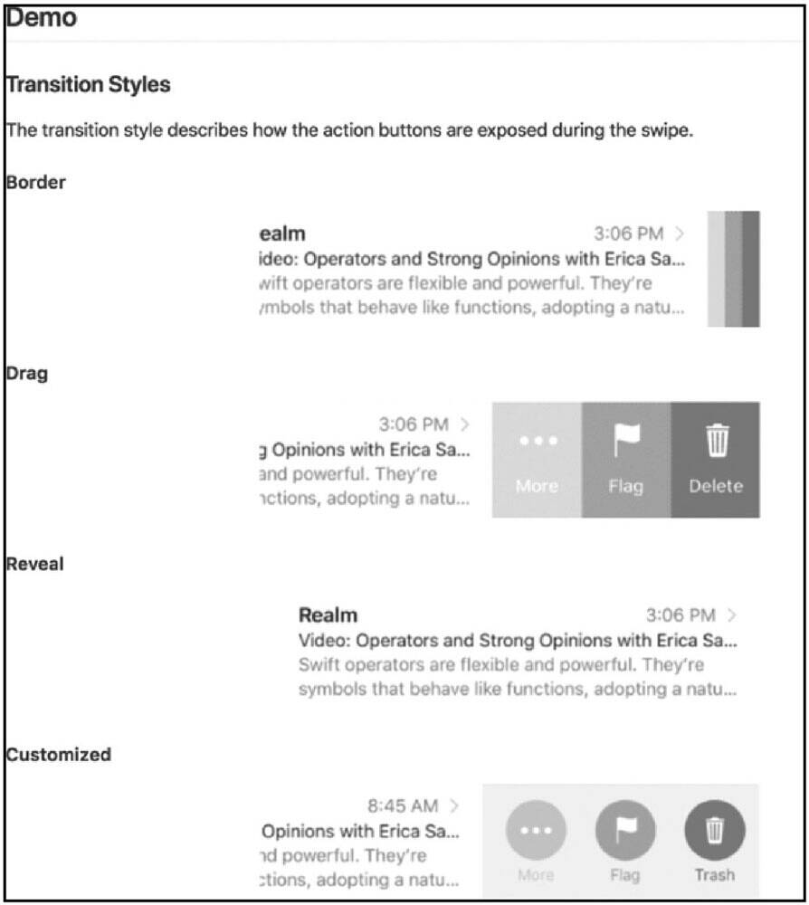
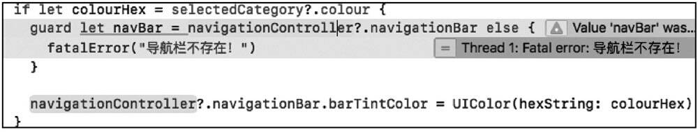

# 第14章 使用Realm进行本地数据存储

接着上一章的项目代码，我们将使用Realm来替代Core Data对本地数据进行存储。在正式开始之前，我们先提交当前项目代码到GitHub。
如果你之前对Realm还不太了解的话，可以直接访问realm.io，通过主页中相关介绍来学习如何使用Realm。在Realm的官网中提供了很多的说明文档以及代码样例。与SQLite和Core Data有所不同，它是开源项目，所以可以深入了解它是如何实现核心功能的。  

我们将要使用的是Realm的Database功能，在 [https://realm.io/products/realm-database](https://realm.io/products/realm-database) 页面中，我们可以选择项目开发的语言，如图14-1所示。当选择了Swift语言以后，Realm就会带我们到Swift开发文档页面。我们可以在该页面中下载Realm for Swift，或者直接从GitHub下载源码。  

   
图14-1 Realm Database的主页  


## 14.1 在项目中集成Realm  

实战：通过CocoaPods方式安装Realm。  

步骤1：打开终端应用程序，通过命令行方式导航到TODO项目的目录，然后执行下面的命令。  
```
pod init
open Podfile -a Xcode
``` 

步骤2：将Podfile的文件内容修改为：  
```
platform :ios, '9.0'

target 'TODO' do
  use_frameworks!

  # Pods for TODO 最新的beta版本为3.2.0-beta.3
  pod 'RealmSwift', '3.2.0-beta.3'

end
```  
步骤3：在终端中执行pod install命令。经过一段时间的等待，Realm已经集成到TODO项目之中。打开TODO并编译该项目，你可能会发现有很多的黄色警告图标，而这些警告均出自RealmSwift。重新打开Podfile文件，在最底下一行添加inhibit_all_warnings!，在终端中执行Pod update命令，再重新编译项目以后警告消失。  

接下来，我们需要在项目中使用Realm。  

步骤4：在AppDelegate中导入Realm。  
```swift
import RealmSwift
```  

步骤5：在didFinishLaunchingWithOptions()方法中，创建一个全新的Realm对象，我们可以把Realm想象为另一个persistentContainer。
```swift
do {
  let realm = try Realm()
} catch {
  print("初始化Realm发生错误。")
}
```
Realm允许我们通过面向对象的方式来管理本地数据，接下来我们需要创建新的Swift类——Data。  

步骤6：在Data Model组中，添加一个新的Swift类型的文件，名称为Data。确保Group为Data Model, Targets为TODO。  

步骤7：修改Data.swift文件中的内容如下。  
```swift
import Foundation
import RealmSwift

class Data: Object {
  var name: String = ""
  var age: Int = 0
}
```
对于一般的数据类来说，这已经足够了。但是作为Realm的数据类，仅仅这样是不行的，我们需要在声明变量的前面加上dynamic关键字。简单点说，即dynamic的意思是该变量是动态的。复杂点说，即dynamic是声明修饰符。大家都知道在几年以前，不管是iOS开发还是MacOS开发所使用的语言都是Objective-C。  

Objective-C和Swift在底层使用的是两套完全不同的机制，Objective-C对象是基于运行时的，它从骨子里遵循了KVC(Key-Value Coding，通过类似字典的方式存储对象信息)以及动态派发(Dynamic Dispatch，在运行调用时再决定实际调用的具体实现)。而Swift为了追求性能，使用的是静态派发(Static Dispatch)，如果没有特殊需要的话，是不会在运行时再来决定这些的。也就是说，Swift类型的对象或方法在编译时就已经决定，而运行时便不再需要经过一次查找，可以直接使用。  

将变量标识为dynamic，就可以允许我们在运行应用的时候监控和改变它。比如，用户可以在应用运行的时候动态改变name这个属性名称，因为Realm在运行的时候可能会根据需要修改数据库结构。  

因为dynamic是Objective-C的API，所以在dynamic关键字的前面还要加上@objc关键字。总而言之，加上@objc dynamic两个关键字以后，就可以在应用运行的情况下，监控和动态修改属性的名称了。  

步骤8：修改Data类的属性为下面这样。  
```swift
class Data: Object {
  @objc dynamic var name: String = ""
  @objc dynamic var age: Int = 0
}
```
接下来我们需要测试Realm是否可以正常运行。  

步骤9：在AppDelegate类的didFinishLaunchingWithOptions()方法中继续添加代码。  
```swift
let data = Data()
data.name = "乐乐"
data.age = 10

do {
  let realm = try Realm()
  try realm.write {
    realm.add(data)
  }
} catch {
  print("初始化Realm发生错误。")
}
```
这里我们利用Data类创建了一个Realm对象，然后设置该对象的两个属性值。在创建Realm成功以后，会通过write()方法将数据对象添加到Realm数据库中。  

构建并运行项目，利用Finder导航到应用的Documents目录中，你可以看到Realm生成的default.realm文件，如图14-2所示。  

   
图14-2 应用程序中的realm文件  

另外，我们也可以通过Realm.Configuration.defaultConfiguration.fileURL了解Realm文件的具体存储位置。  

为了可以查看Realm数据库中的数据，我们可以通过Mac App Store在MacOS中安装Realm Browser，该软件的特点是免费。  

在Realm Browser中，我们可以在左侧的Model中找到Data，右侧是Data的两个属性和一条记录，这条记录是我们在启动应用以后被创建的，如图14-3所示。
   
图14-3 在Realm Browser中查看realm文件中的数据


## 14.2 使用Realm保存数据  

在介绍如何使用Realm保存数据之前，我们先整理一下之前的didFinishLaunching-With Options()方法。  
```swift
func application(_ application: UIApplication, 
    didFinishLaunchingWithOptions launchOptions: [UIApplicationLaunchOptionsKey: Any]?) -> Bool {
  do {
    let realm = try Realm()
  } catch {
    print("初始化Realm发生错误。")
  }

  return true
}
```
在项目导航中删除之前的Data.swift文件，并创建两个新的swift文件：Item.swift和Category.swift，这两个文件的用途是关联Realm数据库中的两个实体。但是，在DataModel.xcdatamodeld文件中，我们已经为Core Data的两个实体创建了内置的Item和Category类。一旦我们在Item.swift文件中声明Item类，编译器就会报错：不能重复声明Item类，如图14-4所示。  

   
图14-4 Xcode中Item的报错  

解决的方法非常简单，在DataModel.xcdatamodeld文件中，分别将两个实体的Codegen都设置为Manual/None即可，或者直接删除该文件。  

- 实战：为Realm设置两个实体类。  

步骤1：将Item.swift类修改为下面这样。
```swift
import Foundation
import RealmSwift

class Item: Object {
  @objc dynamic var title: String = ""
  @objc dynamic var done: Bool = false
}
```

步骤2：将Category.swift类修改为下面这样。  
```swift
import Foundation
import RealmSwift

class Category: Object {
  @objc dynamic var name: String = ""
}
```

接下来，我们需要为这两个实体建立关系，就如同之前在Core Data中创建的一样。首先，设置Category指向所拥有的Item对象，然后设置item对象指向Category。  

步骤3：修改Category类中的代码。  
```swift
class Category: Object {
  @objc dynamic var name: String = ""

  let items = List<Item>()
}
```
List是RealmSwift中定义的集合类，其就像是数组或字典。使用List将会让Realm的数据库操作更加简单。一旦我们定义了List就需要为List中的数据指定类型，当前我们需要让List包含Item类型的对象。请注意List<Item>只是定义了一种数据类型，代表包含的是Item类型的List，但是这里并没有将其实例化为对象，所以最后还需要用()将类型实例化为对象，代表当前初始化的List对象中暂时没有任何的Item对象。  

现在，Category类中包含了一个items属性，用于指向当前类别中所包含的所有Item对象的列表。但是在Realm中，所有的反向关系还需要我们手动定义。所以需要在Item类中继续定义与Category类的关系。  

步骤4：修改Item类中的代码。  
```swift
class Item: Object {
  @objc dynamic var title: String = ""
  @objc dynamic var done: Bool = false

  var parentCategory = LinkingObjects(fromType: Category.self, property: "items")
}
```

这里使用LinkingObjects类将Item对象关联到0个、1个或者多个Category类别上，formType参数用于指定关联的Realm类，我们通过Category.self将Item指向Category类。property参数用于指定我们之前在Category中所设置的关系。
接下来，我们需要修复用Realm替代Core Data后所产生的各种报错。  

- 实战：修复Xcode中产生的问题。  

步骤1：在Category控制器类中，定义一个Realm对象。  
```swift
import RealmSwift

class CategoryViewController: UITableViewController {

  let realm = try! Realm()
  ……
```

在这里我们使用try！来强制实例化Realm，虽然代码得到了简化，但是危险性极高，强烈建议大家在编写自己项目的时候一定要使用do{……} catch{……}的方法，否则可能会出现一些莫名其妙的问题。  

步骤2：在Category控制器类的addButtonPressed()方法中，修改创建类别的代码。
```swift
let action = UIAlertAction(title: "添加", style: .default) { (action) in
  let newCategory = Category()
  newCategory.name = textField.text!

  self.categories.append(newCategory)
  self.saveCategories()
}
```

这里将原来的Category(context: self.context)修改为Category()，因为现在调用的是RealmSwift框架中的类。  

步骤3：将saveCategories()方法修改为save(category: Category)。  
```swift
func save(category: Category) {
  do {
    try realm.write {
      realm.add(category)
    }
  } catch {
    print("保存Category错误：\(error)")
  }
  tableView.reloadData()
}
```

每一次在保存的时候，我们都需要传递Category对象到save()方法。  

步骤4：再回到addButtonPressed()方法中，将self.saveCategories()修改为self.save(category: newCategory)。  

目前为止，我们已经将创建Category的代码修复完成，为了可以测试创建功能是否正常，我们先注释掉其他所有有问题的代码。  

构建并运行项目，在应用启动以后添加同之前一样的几个类别，然后在Realm Browser中打开Realm文件，可以看到图14-5所示的信息。  

   
图14-5 查看Realm文件中的Category信息  

通过Realm Browser可以发现：当前Category实体中有两个属性，即name是类别的名称，items用于指向每个类别所拥有的item数量，只不过目前还没有任何相关的Item对象。  

## 14.3 使用Realm读取数据  

在本节我们将会通过Realm读取需要的数据。  

步骤1：修改Category控制器类的loadCategories()方法为下面这样。  
```swift
func loadCategories() {
  categories = realm.objects(Category.self)

  tableView.reloadData()
}
```

这里我们使用objects()方法获取指定实体的所有记录。因为它的返回值是Results，所以接下来，我们需要修改在类中声明的categories的类型。  

步骤2：将var categories = [Category]()修改为var categories: Results<Category>?，这代表categories是Results类型，该类型中的结果是Category的对象。注意，categories是可选类型，因为你在第一次运行应用的时候，类别的数量肯定是0。  

在这次修改以后，numberOfRowsInSection()方法会报错，因为此时的categories是可选的，我们需要对其做拆包处理。这里我们使用一个全新的方式，将之前的代码修改为return categories.count ? ? 1。我们管？？叫空合运算符，简单来说就是当？？前面的值为nil的时候，表达式的值为？？后面的值。如果前面的值不为nil，表达式的值就是前面的值。另外？？前面必须是一个可选值。  

对于return categories.count ? ? 1来说，如果categories为nil，则返回1；不为nil，则返回．count的值。  

步骤3：在cellForRowAt()方法中，将cell.textLabel.text = categories[indexPath.row]. name修改为cell.textLabel.text = categories? [indexPath.row].name ? ? “没有任何的类别”。因为考虑到在没有类别的时候，表格视图中指定单元格的数量为1，所以在这种情况下需要设置一个特别的单元格。  

步骤4：在prepare()方法中，修改destinationVC.selectedCategory = categories [indexPath.row]为destinationVC.selectedCategory = categories? [indexPath.row]，该行的报错消失。  

步骤5：在addButtonPressed()方法中，注释掉self.categories.append(newCategory)。

步骤6：最后删除没用的let context =(UIApplication.shared.delegate as! AppDelegate). persistentContainer.viewContext的属性声明。  

为了可以测试在没有类别的时候会显示指定的信息，注释掉viewDidLoad()方法中的loadCategories()。  

构建并运行项目，可以看到表格中显示的指定信息，尽管当前的categories中没有任何的类别对象，应用也不会发生崩溃。测试完成以后请取消viewDidLoad()方法中的loadCategories()的注释，如图14-6所示。  

   
图14-6 测试没有事务的情况  

接下来，让我们继续修复TodoList控制器中的问题。  

- 实战：修复TodoList控制器的问题。  

步骤1：将import CoreData修改为import RealmSwift。  

步骤2：取消var selectedCategory中调用loadItems()方法的注释。步骤3：删除类中对context变量的声明。  

步骤4：添加let realm = try! Realm()属性的声明。  
 
步骤5：修改loadItems()方法为下面这样。  
```swift
func loadItems() {
  itemArray = selectedCategory.items.sorted(byKeyPath: "title", ascending: true)
  tableView.reloadData()
}
```

通过selectedCategory的items关系属性可以得到关联的所有Item对象，然后通过sorted()方法将其按title属性排序。  

此时该行会报错：不能将’Results? ’类型的值赋给’[Item]’类型。回到类中声明itemArray的地方，将声明修改为var itemArray: Results<Item>?。  

接下来为大家介绍Xcode编辑器的一个非常亲民的特性——批量替换变量名称。因为现在itemArray存储的不是数组类型，所以需要将它的名称修改为todoItems。  

- 实战：将itemArray修改为todoItems。  

步骤1：选中itemArray然后右击，在快捷菜单中选择Refactor/Rename，如图14-7所示。  

    
图14-7 在Xcode中启用Rename功能  

步骤2：在当前位置修改itemArray为todoItems，相关的所有变量名称均会被显式修改，如图14-8所示。  

   
图14-8 在Xcode中显示欲更名的变量  

步骤3：如果需要修改注释中的变量，则可以单击名称右边的+号，如图14-9所示。  

   
图14-9 通过Xcode修改变量名称  

步骤4：修改numberOfRowsInSection()方法中的代码为return todoItems.count ? ? 1。  

步骤5：修改cellForRowAt()方法为下面的样子  
```swift
override func tableView(_ tableView: UITableView, cellForRowAt indexPath:IndexPath) -> UITableViewCell {
  let cell = tableView.dequeueReusableCell(withIdentifier: "ToDoItemCell", for:indexPath)

  if let item = todoItems? [indexPath.row] {
    cell.textLabel?.text = item.title
    cell.accessoryType = item.done == true .checkmark : .none
  } else {
    cell.textLabel?.text = "没有事项"
  }

  return cell
}
```

步骤6：注释掉didSelectRowAt()方法中的所有代码，我们将会在下一节进行修复。  

步骤7：修改UIAlertAction()闭包中的代码。  
```swift
let action = UIAlertAction(title: "添加项目", style: .default) { (action) in
  // 用户单击添加项目按钮以后要执行的代码
  if let currentCategory = self.selectedCategory {
    do {
      try self.realm.write {
        let newItem = Item()
        newItem.title = textField.text!
        currentCategory.items.append(newItem)
      }
    } catch {
      print("保存Item发生错误：\(error)")
    }
  }
  self.tableView.reloadData()
}
```
这里先拆包selectedCategory对象，如果有值存在，则创建新的Item对象，并设置它的title属性，以及通过关系属性items将新Item对象添加到关系中。
构建并运行项目，在事务列表中添加几个事项。另外，在Realm Browser中可以看到与购物清单关联的Item一共有3个，如图14-10所示。
   
图14-10 在添加事项以后查看realm文件

## 14.4 使用Realm修改和移除数据  

本节我们会修改事项的完成状态。  

修改TodoList控制器类的didSelectRowAt()方法。  
```swift
override func tableView(_ tableView: UITableView, didSelectRowAt indexPath: IndexPath) {

  if let item = todoItems? [indexPath.row] {
    do {
      try realm.write {
        item.done = ! item.done
      }
    } catch {
      print("保存完成状态失败：\(error)")
    }
  }

  tableView.beginUpdates()
  tableView.reloadRows(at: [indexPath], with: UITableViewRowAnimation.none)
  tableView.endUpdates()

  tableView.deselectRow(at: indexPath, animated: true)
}
```  

构建并运行项目，切换事项的完成状态，在Realm Browser中可以看到所发生的变化。如果你仔细观看就会发现一旦切换了状态，Realm马上就会发生变化，速度非常快，如图14-11所示。  

   
图14-11 在应用中修改事项状态以后realm文件变发生了变化  

作为测试，如果想要删除Realm中的某个记录的话，可以直接使用Realm类的delete()方法。例如TodoList控制器类的didSelectRowAt()方法，在realm.write的闭包中修改代码为下面的样子。  
```swift
try realm.write {
  realm.delete(item)
  //item.done = ! item.done
}
```  

如果此时构建并运行项目的话，单击某个事项就会删除它。但是此时编译器会崩溃并终止运行，因为我们是针对修改状态编写的代码，后面的reloadRows()方法就无法更新了，从而导致应用程序运行崩溃。  

## 14.5 使用Realm检索数据  

在前面的章节中已经向大家介绍了如何通过Realm来创建、读取、修改和删除(CRUD)数据。本节我们将会了解如何使用Realm检索数据。  

步骤1：解除TodoList控制器类的UISearchBarDelegate委托方法的注释。  

步骤2：修改searchBarSearchButtonClicked()方法为下面这样。  
```swift
func searchBarSearchButtonClicked(_ searchBar: UISearchBar) {
  todoItems  =  todoItems.filter("title  CONTAINS[c]  %@",  searchBar.text! ).sorted(byKeyPath: "title", ascending: false)
}
```  

在该方法中，我们将todoItems过滤为title属性只包含搜索栏中输入的文字，并且对检索的数据进行排序。  

对于textDidChange()方法，我们保留原来的代码即可。  

步骤3：对于搜索来说，我们更希望将检索到的数据按照创建时间排序，因此需要在Item类中添加一个新的属性。  
```swift
class Item: Object {
  @objc dynamic var title: String = ""
  @objc dynamic var done: Bool = false
  @objc dynamic var dateCreated: Date?  // 用于保存Item对象的创建时间

  var parentCategory = LinkingObjects(fromType: Category.self, property: "items")
}
```

步骤4：在TodoList控制器类的addButtonPressed()方法的UIAlertAction的闭包中，添加对dateCreated属性的赋值。  
```swift
try self.realm.write {
  let newItem = Item()
  newItem.title = textField.text!
  newItem.dateCreated = Date() // Date()会返回当前时间
  currentCategory.items.append(newItem)
}
```  

步骤5：修改searchBarSearchButtonClicked()方法中排序的代码，并调用tableView的reloadData()方法。  
```swift
func searchBarSearchButtonClicked(_ searchBar: UISearchBar) {
  todoItems = todoItems?.filter("title CONTAINS[c] %@", searchBar.text!).sorted(byKeyPath: "dateCreated", ascending: false)

  tableView.reloadData()
}
```
构建并运行项目，应用程序运行的时候可能会发生崩溃。单击绿色列表图标，可以查看列出的相关解释信息，如图14-12所示。在应用运行之后，我们调整了Item类，添加了dateCreated属性，而此时Xcode不知道在应用运行的时候要如何处理该属性。  

   
图14-12 TODO在应用时报错  

最简单的方式是通过Finder导航到Realm文件所在的文件夹，删除与Realm相关的两个文件及一个文件夹。重新构建并运行项目即可。此时的应用中不会有任何的类别与事项，我们需要重新添加相关数据。这时，通过Realm Browser可以在Item类发现新添加的dateCreated属性，如图14-13所示。  

   
图14-13 删除realm文件后再次运行项目  

## 14.6 回顾Realm的操作流程  

在本节，我们会一起回顾和梳理在项目中操作Realm的全部流程。在此之前，我们需要先做一下整理工作。  

步骤1：在AppDelegate.swift文件中删除对Core Data框架的导入，删除saveContext()方法和persistentContainer属性。  

步骤2：删除applicationWillTerminate()方法中对saveContext()方法的调用。  

步骤3：在didFinishLaunchingWithOptions()方法中，我们初始化了一个Realm对象，主要是确保在应用中Realm可以正常运行，但是在AppDelegate类中我们并没有实际用到它，因此可以使用下划线来代替变量名。另外，注释掉之前的print语句。  
```swift
//print(Realm.Confi guration.defaultConfi guration.fi leURL! )

do {
  _ = try Realm()
} catch {
  print("初始化Realm发生错误。")
}
```  

对于两个Realm的实体类来说，Category是我们首个创建的Realm对象类，它是Object的子类，我们能够通过它将数据保存到Realm数据库中。在该类中我们定义了name属性，代表类别的名称。dynamic代表可以在应用运行的时候监控属性中值的变化。另外一个是关系属性items，它指定了每个Category都可以有多个Item对象，它的类型是List。  

Item类同样继承于Object，它包含三个属性，同时我们还指定了一个反转关系parentCategory，通过它将每个Item对象与其所属类别连接起来。在创建反转关系的时候，需要指明连接目标的类以及连接目标(Category类)中的关系属性名称(items)。  

在Category控制器类中，我们创建了Realm类型的对象，将categories属性从数组变成了新的集合类型——Results，并且出于安全的考虑将其设置为可选。当我们在viewDidLoad()方法中载入所有类别的时候，利用了Realm的objects()方法。在刷新表格视图的时候，如果categories没有值，则让表格只显示一个单元格，否则会依据具体数量显示单元格。我们通过Realm的write()方法来保存新的类别。  

当用户单击事务单元格以后，会执行didSelectRowAt()委托方法，通过performSegue()方法执行指定的Segue。在进行控制器切换之前，还会利用prepare()方法获取目标控制器对象，并将用户选中的事务信息传递到目标控制器。在将category对象赋值给TodoList控制器的selectedCategory属性以后，会执行loadItems()方法。与loadCategories()方法类似，这里会获取当前类别中的所有Item对象的连接，只不过这里是按照title属性排序的。  

在TodoList控制器类中，todoItems也是Results类型，在与表格相关的委托方法中，我们还是按部就班地执行相关的代码。在添加新事项的时候，我们会在UIAlertAction闭包中创建新的Item对象，为Item对象的属性赋值，让新Item加入Category之中，而这一切都需要在Realm的write()方法的闭包中完成。  

如果用户单击了某个单元格事项，则会切换Item对象的done属性值。  

最后是搜索栏的处理，通过searchBarSearchButtonClicked()方法来搜索特定文字内容的Item对象。这里通过filter()方法，并使用类似于SQL语句的字符串参数，搜索title属性中包含指定字符串的对象，并对结果按创建时间排序。当用户结束搜索以后，通过textDidChange()方法，我们在结束搜索以后重置todoItems对象。  

## 14.7 让单元格可以滑动  

在进行接下来的操作之前，让我们先提交代码到GitHub，可以设置提交信息为：使用Realm存储本地数据。  

在此之前，我们用了很长的时间去解决如何在后台处理我们的数据。从本节开始，我们将会逐步完善前端设计，不断增强应用的用户体验。因为目前的应用看起来还是相当幼稚的，第一个需要实现的功能就是删除一个不需要的事务。  

删除事务的操作可以仿照邮件应用，如果我们在某一封邮件的单元格上面向左滑动手指，就可以看到相应的选项。如果再继续往左滑动，就可以直接将邮件删除。要想实现这一功能，可以借助CocoaPods。  

在CocoaPods主页中搜索SwipeCellKit，通过该项目的GitHub连接，我们可以看到它包含了各种风格的过渡效果，如图14-14所示。  

   
图14-14 SwipeCellKit介绍  

- 实战：在项目中安装SwipeCellKit。  

步骤1：关闭现有的TODO项目，在终端应用中导航到TODO项目目录，通过open Podfile-a Xcode命令编辑Podfile文件。  

步骤2：将文件修改为下面这样。  
```swift
platform :ios, '10.0'

target 'TODO' do
  use_frameworks!

  # Pods for TODO
  pod 'RealmSwift', '3.2.0-beta.3'
  pod 'SwipeCellKit'
end

inhibit_all_warnings!
```

步骤3：在终端中执行pod install命令。  

接下来，我们会实现滑动单元格的功能。  

- 实战：实现用户的滑动操作交互功能。  

步骤1：在Category控制器类中导入SwipeCellKit框架import SwipeCellKit。  

步骤2：在cellForRowAt()方法中，将获取的可复用单元格转换为SwipeTableViewCell类型，并将cell的delegate属性设置为self。  
```swift
let  cell  =  tableView.dequeueReusableCell(withIdentifier:  "CategoryCell",  for:indexPath) as! SwipeTableViewCell
cell.delegate = self
```

步骤3：在Category控制器类的最后添加一个extension。  
```swift
// MARK: - Swipe Cell Delegate Methods

extension CategoryViewController: SwipeTableViewCellDelegate {
func  tableView(_  tableView:  UITableView,  editActionsForRowAt  indexPath:IndexPath, for orientation: SwipeActionsOrientation) -> [SwipeAction]? {
    guard orientation == .right else { return nil }

    let deleteAction = SwipeAction(style: .destructive, title: "删除") { action,indexPath in
      // handle action by updating model with deletion
      print("类别被删除")
    }

    // customize the action appearance
    deleteAction.image = UIImage(named: "delete")
    return [deleteAction]
  }
}
```

你可以直接从GitHub中复制editActionsForRowAt()方法的所有代码到当前的扩展中，当用户用手指在单元格上滑动的时候会触发该方法。  

在方法的内部，只接受手指从右侧滑动的操作，否则会返回nil。如果用户单击了title为删除的按钮，则会执行闭包中的代码，目前闭包中只有一行注释语句。另外，在方法中还定义了删除按钮的图标为delete，但是现在在该项目中还没有该图标。  

通过提供的资料文件找到Trash-Icon.png文件，并将其添加到项目的Assets.xcassets文件之中，然后修改deleteAction.image = UIImage(named: "delete")代码为deleteAction.image= UIImage(named: "Trash-Icon")。
如果此时构建并运行项目的话，应用会崩溃，控制台会打印类似下面的信息。  
```
Could not cast value of type 'UITableViewCell' (0x1063f7038) to 'SwipeCellKit.SwipeTableViewCell' (0x103d5e650).
```

之所以出现上述情况，是因为Xcode不能将UITableViewCell类型的对象转换为SwipeTableViewCell类型。  

步骤4：在Main.storyboard中选中Category控制器表格视图里面的单元格，在Identif ier Inspector中，将Class设置为SwipeTableViewCell，将Module设置为SwipeCellKit，因为该单元格类来自于SwipeCellKit框架，如图14-15所示。  

   
图14-15 设置事务单元格的属性  

构建并运行项目，在Category控制器视图中从右向左拖动鼠标，会出现图14-16所示的效果。    

   
图14-16 测试SwipeCellKit的执行效果  

当前的问题在于单元格的高度不够，“删除”图标显示不完全。  

步骤5：在viewDidLoad()方法中添加一行代码tableView.rowHeight = 80.0。
再次构建并运行项目，可以看到完整的图标，如图14-17所示，如果单击删除按钮的话，在控制台会看到通过print语句打印的相关信息。  

   
图14-17 正确的运行效果  

接下来，我们需要在editActionsForRowAt()方法里面的SwipeAction()的闭包中实现类别删除的代码。  
```swift
let  deleteAction  =  SwipeAction(style:  .destructive,  title: "删除")  {  action,indexPath in
  if let categoryForDeletion = self.categories? [indexPath.row] {
    do {
        try self.realm.write {
        self.realm.delete(categoryForDeletion)
      }
    } catch {
      print("删除类别失败：\(error)")
    }

    tableView.reloadData()
  }
}
```  

在闭包中，先拆包categories中的指定事务，如果该值存在则将其删除，最后再刷新表格视图。  

构建并运行项目，可以再创建一个新的事务，然后再将其删除，之后运行正常。  

在邮件程序中，我们可以通过从右向左滑动直接删除邮件，但是在目前的TODO项目中，我们只能先滑动，再单击删除按钮来完成相同的任务。接下来，我们就在TODO项目中实现该功能。  

在GitHub中SwipeCellKit的主页面上找到Usage部分中editActions Options For Row At()方法的定义。这是一个可选方法，用于实现对单元格的一些自定义的操作。  

将下面的方法复制到editActionsForRowAt()方法的下面，将方法中的transitionStyle一行代码注释掉。  
```swift
func tableView(_ tableView: UITableView, editActionsOptionsForRowAt indexPath:IndexPath, 
		for orientation: SwipeActionsOrientation) -> SwipeTableOptions {
    var options = SwipeTableOptions()
    options.expansionStyle = .destructive
    // options.transitionStyle = .border
    return options
}
```  

在方法中可以为options设置扩展风格(Expansion Style)和过渡风格(Transition Styles)，如图14-18所示。这里我们将会使用扩展的Destructive风格。  

   
图14-18 SwipeCellKit中的扩展风格  

最后，我们直接将editActionsForRowAt()方法中的tableView.reloadData()代码删除就可以了，因为删除单元格的操作已经由editActionsOptionsForRowAt()方法替我们完成了。  

如果对于TodoList控制器类来说，要想实现删除Item对象的功能，同样需要上面的操作。你可以自己对比Category控制器类先尝试着为TodoList控制器类添加滑动单元格的功能，然后再阅读下面的操作步骤。  

- 实战：为TodoList控制器添加单元格的滑动删除功能。  

步骤1：在TodoList控制器类中导入import SwipeCellKit框架。  

步骤2：在viewDidLoad()方法中设置单元格的高度tableView.rowHeight = 80.0。  

步骤3：在cellForRowAt()方法中将cell强制转换为SwipeTableViewCell类型，并且设置其delegate属性值。  
```swift
let cell = tableView.dequeueReusableCell(withIdentifier: "ToDoItemCell", for:indexPath) as! SwipeTableViewCell
cell.delegate = self
```  

步骤4：将Category控制器类关于SwipeTableViewCellDelegate协议的扩展代码全部复制到TodoList控制器中，并修改为下面的样子。  
```swift
// MARK: - Swipe Cell Delegate Methods
extension TodoListViewController: SwipeTableViewCellDelegate {
  func tableView(_ tableView: UITableView, editActionsForRowAt indexPath:IndexPath, for orientation: SwipeActionsOrientation) -> [SwipeAction]? {
    guard orientation == .right else { return nil }

    let deleteAction = SwipeAction(style: .destructive, title: "删除") { action,indexPath in
      // 通过todoItems获取到用户将会删除的Item对象
      if let itemForDeletion = self.todoItems? [indexPath.row] {
        do {
          try self.realm.write {
            self.realm.delete(itemForDeletion) // 删除Item对象
          }
        } catch {
          print("删除事项失败：\(error)")
        }
      }
    }

    // 自定义单元格在用户滑动后所呈现的外观
    deleteAction.image = UIImage(named: "Trash-Icon")
    return [deleteAction]
  }

  func tableView(_ tableView: UITableView, editActionsOptionsForRowAt indexPath:IndexPath, for orientation: SwipeActionsOrientation) -> SwipeTableOptions {
    var options = SwipeTableOptions()
    options.expansionStyle = .destructive
    return options
  }
}
```  

步骤5：在Main.storyboard文件中，将TodoList控制器视图中的单元格的Class设置为SwipeTableViewCell，将Module设置为SwipeCellKit。  

构建并运行项目，如果愿意的话还可以打开Realm Browser，观察是否可以成功删除指定的事项。

## 14.8 让App的界面更加丰富多彩  

目前，TODO的颜色还是比较单调的，没有人会喜欢这样一款颜色朴素的应用程序。接下来我们会借助第三方开源类，为项目添加丰富多彩的颜色，让它显得更加生动活泼。  

在之前的项目中我们曾使用过Chameleon框架。通过该框架，我们为应用程序界面设置了漂亮的颜色。在本节中我们将会使用该框架的一些其他的功能。  

充分利用这些第三方类库，可以帮助我们快速完成项目的开发，而不用所有的代码都自己来亲自编写，这样可以使开发更有效率。很多程序员也会做出非常漂亮、实用的东西，并乐于将它们作为第三方类库分享到GitHub。而我们只需要通过非常少的代码去直接调用它们，何乐而不为呢？  

在Chameleon主页面上找到Swift 3的CocoaPods的安装代码，并将其复制到项目的Podfile文件中。  
```swift
# Pods for TODO
pod 'RealmSwift', '3.2.0-beta.3'
pod 'SwipeCellKit'
pod 'ChameleonFramework/Swift', :git => 'https://github.com/ViccAlexander/Chameleon.git'
```  

在终端应用程序中执行pod install命令。  

在安装完成以后，打开项目并使用Control + B重新构建项目，确保没有任何报错。  

在chameleon框架的文档中找到UIColor Methods的链接，在里面可以看到如何设置一个随机颜色。  

- 实战：为表格设置随机颜色。  

步骤1：在Category控制器类中导入框架import Chameleon Framework。  

步骤2：在cellForRowAt()方法中，添加一行代码：cell.backgroundColor = UIColor.randomFlat。  

构建并运行项目，可以看到图14-19所示的效果。  

   
图14-19 为TODO添加颜色  

在目前的表格视图中，每个单元格之间都会有一条分割线，在有单元格背景颜色的情况下，我们可以将其取消。  

步骤3：在Category控制器类的viewDidLoad()方法中，添加一行tableView. separatorStyle = .none代码。  

目前，在Category控制器中显示的类别单元格的背景色都是随机分配的，这也就意味着一旦我们关闭TODO再重新打开它的时候，颜色就会发生变化。如何固定住每个事务单元格的背景颜色呢？我们将会把与事务关联的颜色作为Category实体的属性。  

可能你会想到在Category类中添加一个新的colour属性，属性的类型为UIColor，如下面这样。  
```swift
class Category: Object {
  @objc dynamic var name: String = ""
  @objc dynamic var colour: UIColor = UIColor()

  let items = List<Item>()
}
```  

在该类中我们添加一个colour属性，并将其类型设置为UIColor。这样的话，在运行的时候会报如下的错误：  
```swift
＊＊＊ Terminating app due to uncaught exception 'RLMException', reason: 'Property'colour' is declared as 'UIColor', 
which is not a supported RLMObject property type.All  properties  must  be  primitives,  NSString,  NSDate,  NSData,  
NSNumber,  RLMArray,RLMLinkingObjects, or subclasses of RLMObject. 
See https://realm.io/docs/objc/latest/api/Classes/RLMObject.html for more information.'
```  

上述错误的意思是：Realm数据库只能保存基本类型、NSString、NSDate、NSData、NSNumber、RLMArray、RLMLinkingObjects或者是RLMObject的子类对象。UIColor不能作为RLMObject的属性来进行存储。因此，我们只能使用String类型来存储颜色值。  

- 实战：使用Realm存储文字的颜色信息。  

步骤1：在Category类中添加一个新的colour属性，属性的类型为String。  
```swift
class Category: Object {
  @objc dynamic var name: String = ""
  @objc dynamic var colour: String = ""

  let items = List<Item>()
}
```

步骤2：在Category控制器类创建Category对象的UIAlertAction闭包中，修改代码为下面的样子。  
```swift
let action = UIAlertAction(title: "添加", style: .default) { (action) in
  let newCategory = Category()
  newCategory.name = textField.text!
  newCategory.colour = UIColor.randomFlat.hexValue()
  self.save(category: newCategory)
}
```

这里通过hexValue()方法获取颜色的hex值，它是字符串类型的值。  

步骤3：在cellForRowAt()方法中，添加一行代码：cell.backgroundColor = UIColor(hexString: categories? [indexPath.row].colour ? ? "1D9BF6")。  

这样设置单元格的背景色会从Realm的数据表中读取，如果无法获取到Category对象，则会直接设置背景色为1D9BF6。  

构建并运行项目，然后退出再重新进入，类别的颜色不会发生变化。  

对于TodoList控制器来说，我们希望在表格中创建单元格的背景色渐变的效果。用蓝色来举例，第一个单元格的颜色为浅浅的蓝色，第二个为浅蓝色，第三个为蓝色，第四个为深一点儿的蓝色……以此类推。通过Chameleon可以为我们实现这个效果。  

在ChameleonFramework中包含了24种不同颜色的亮暗素材，我们可以在GitHub主页查询到，如图14-20所示。  

   
图14-20 Chameleon提供的24种渐变色  

- 实战：为事项单元格设置渐变色。  

步骤1：在TodoList控制器类的cellForRowAt()方法中添加一行代码。  
```swift
if let item = todoItems? [indexPath.row] {
  cell.textLabel.text = item.title
  cell.accessoryType = item.done == true .checkmark : .none

  // 设置单元格的背景色
  cell.backgroundColor  =  FlatSkyBlue().darken(byPercentage:  CGFloat(indexPath.
row / todoItems.count))

}else {
  cell.textLabel.text = "没有事项"
}
```

通过FlatSkyBlue我们可以获取天空蓝的颜色，再通过它的darken()方法可以自定义这个天空蓝的阴暗程度，0为最浅，1为最深。所以在byPercentage参数中，我们通过indexPath.row / todoItems.count表达式来计算出阴暗度，以5个事项为例，第一个阴暗度为0，然后是0.2、0.4、0.6和0.8。  

但是此时编译器会报错，因为todoItems是可选类型，所以todoItems.count的结果就是可选整型。整个的计算结果就是可选单精度。这里需要利用可选绑定进行修正。  

步骤2：将上面的方法进一步修改为下面这样。  
```swift
if let colour = FlatSkyBlue().darken(byPercentage: CGFloat(indexPath.row/todoItems!.count)) {
  cell.backgroundColor = colour
}
```

修改后使用todoItems.count将其强制拆包，这样做很安全，因为是通过if语句对其进行了拆包的。  

步骤3：在viewDidLoad()方法中，添加一行tableView.separatorStyle = .none代码，删除单元格之间的分割线。  

构建并运行项目，在TodoList表格中添加一些事项，效果如图14-21所示。  

   
图14-21 单元格中生成的颜色  

目前，事项中所有的单元格都是同一种颜色，并没有按照我们想象的效果呈现。问题出现在CGFloat(indexPath.row / todoItems.count)一句。虽然我们将计算的结果强制转换为单精度，但是在Swift语言中，整型值(indexPath.row的值)除以整型值(todoItems.count的值)的结果还是整型值，这也就意味着1/5、2/5、3/5……的值都是0, Swift会将结果小数点后面的值去掉，返回一个整型，即便最后将其转换为单精度，结果也是0.0。
因此，我们需要将byPercentage参数的代码修改为：byPercentage: CGFloat(indexPath.row)/ CGFloat(todoItems.count)，这样生成的才是有效的参数值。
构建并运行项目，可以看到效果如图14-22所示。  

   
图14-22 单元格中生成的渐变色  

这里还有一个问题，越来越深的天空蓝色使得我们根本无法看到下面几个单元格的文字内容，其实ChameleonFramework已经为我们提供了相应的解决方案。在GitHub中ChameleonFramework的主页面里找到对比文本(Contrasting Text)部分，如图14-23所示。  

   
图14-23 Chameleon的对比文本  

简单来说，借助Chameleon我们可以让文字从背景颜色中脱颖而出。  

根据Chameleon算法，利用对比颜色的特征我们可以得到最好的对比色，从而让文字在背景色中突出出来。我们只需要提供背景色的颜色，就可以得到适合的文本颜色。  

步骤4：在上面的设置单元格的代码中添加下面的一行代码。  
```swift
if let colour = FlatSkyBlue().darken(byPercentage: CGFloat(indexPath.row)/CGFloat(todoItems.count)) {
  cell.backgroundColor = colour
  cell.textLabel?.textColor = ContrastColorOf(colour, returnFlat: true)
}
```

通过ContrastColorOf()方法，我们可以得到以colour为背景色的最为合适的文本颜色或者是对比色，returnFlat参数用于确定是否为平涂。
构建并运行项目，可以看到图14-24所示的效果。  

   
图14-24 最终的对比文本效果

在当前情况下，所有的文字颜色都是白色，如果我们的背景色是黑白渐变的话，文字颜色也会随着变化。如果你愿意，可以将let colour = FlatSkyBlue()修改为let colour =FlatWhite()，运行效果如图14-25所示。  

   
图14-25 不同背景的不同对比文本效果  

为了和之前Category控制器中事务单元格的颜色一致，接下来我们将单元格的颜色修改为与事务单元格一致的颜色。  

将let colour = FlatSkyBlue()代码修改为从Category控制器类传递过来的Category对象的颜色值：let colour = UIColor(hexString: selectedCategory.colour)?。因为selectedCategory是可选的，所以这里使用！将其强制拆包。又因为之前通过if语句将item拆包，所以可以确保selectedCategory值不会为nil。最后的问号则会通过当前的if语句进行拆包，所以这句代码不会发生问题。
构建并运行项目，可以看到效果如图14-26所示。  

   
图14-26 TODO项目的运行效果  

因为购物清单单元格的背景色为红色，所以在事项表格中的单元格背景色就是对应的红色由亮到暗。

## 14.9 调整导航栏的UI  

我们之前做了大量的工作来美化应用的用户界面，在本章的最后一节，我们将会修整一些东西，让TODO看起来更像是一款可以上架到App Store上的真正应用。
首先是导航栏的界面，我们希望它能够大一些，在Main.storyboard文件中，选中Navigation Bar，在Attributes Inspector中勾选Navigation Bar部分中的Perfers Large Titles选项。另外，还需要将Large Title Text Attributes部分中的Title Color设置为白色。  

构建并运行项目，可以看到图14-27所示的效果。  

   
图14-27 TODO的导航栏设置效果  

接下来，我们将TodoList控制器的导航栏调整为和Category单元格一样的颜色。  

修改TodoList控制器类的viewDidLoad()方法为下面的样子。  
```swift
override func viewDidLoad() {
  super.viewDidLoad()

  if let colourHex = selectedCategory.colour {

    guard let navBar = navigationController.navigationBar else {
      fatalError("导航栏不存在！")
    }

      navigationController.navigationBar.barTintColor  =  UIColor(hexString:colourHex)
  }

  tableView.rowHeight = 80.0
  tableView.separatorStyle = .none
}
```  

通过navigationBar.barTintColor我们可以修改当前控制器的导航栏颜色。另外，因为navigationController是可选的，所以我们先利用guard语句判断navigationController是否存在。  

构建并运行项目，当进入事项界面后应用程序崩溃，如图14-28所示。  

   
图14-28 导航栏不存在崩溃  

问题的原因就在于导航栏不存在。  

对于初学者来说，应用程序在运行时发生崩溃是件非常可怕的事情，但同时它也是一件好事，我们可以发现代码中潜在的Bug，所以千万不要着急和烦恼，根据提示解决问题就好。

对于控制器类的viewDidLoad()方法来说，它会在当前控制器内部的UI控件全部被载入以后被调用。但是，我们的TodoList控制器是在导航控制器的控制器堆栈之中，导航栏并不属于TodoList控制器的UI控件，所以这个时候navigationController还是nil。  

要想解决这个问题，我们需要在控制器类中添加另外一个方法——viewWillAppear()，该方法会在所有视图控件完全都准备好，即将呈现到屏幕上的时候被调用。此时的navigationController的值就不会是nil了。
将之前的代码剪切到viewWillAppear()方法中。  
```swift
override func viewWillAppear(_ animated: Bool) {
  if let colourHex = selectedCategory.colour {
    title = selectedCategory.name
    guard let navBar = navigationController.navigationBar else {
      fatalError("导航栏不存在！")
    }

    navBar.barTintColor = UIColor(hexString: colourHex)
  }
}
```

这里，我们还设置了title属性为类别的名称，title属性代表的是导航栏中的标题，之前默认值为事项，现在让它显示事务的名称。因为之前已经对selectedCategory拆包，所以直接使用强制拆包即可。
构建并运行项目，运行效果如图14-29所示。  

   
图14-29 根据事务颜色设置导航栏颜色  

接下来，我们还需要调整搜索栏的颜色。  

首先为搜索栏与TodoList控制器类建立IBOutlet关联，将name设置为searchBar。  

在viewWillAppear()方法中添加对搜索栏颜色设置的代码。  
```swift
override func viewWillAppear(_ animated: Bool) {
  if let colourHex = selectedCategory.colour {
    title = selectedCategory.name
    guard let navBar = navigationController.navigationBar else {
      fatalError("导航栏不存在！")
    }

    if let navBarColor = UIColor(hexString: colourHex) {
      navBar.barTintColor = navBarColor
      navBar.tintColor = ContrastColorOf(navBarColor, returnFlat: true)
      searchBar.barTintColor = navBarColor
    }
  }
}
```

因为UIColor(hexString: colourHex)生成的是可选值，所以这里将其拆包，再针对导航栏的颜色以及搜索栏的颜色进行赋值。另外，我们还通过navBar.tintColor设置了导航栏中按钮文字的颜色，这里使用对比色。
构建并运行项目，运行效果如图14-30所示。  

   
图14-30 设置搜索栏的颜色  

接下来，我们还要修改导航栏中标题的颜色，因为在故事板中将导航栏设置为Large，所以需要通过largeTitleTextAttributes属性进行设置。继续在viewWillAppear()方法中添加代码。  
```swift
if let navBarColor = UIColor(hexString: colourHex) {
  navBar.barTintColor = navBarColor
  navBar.tintColor = ContrastColorOf(navBarColor, returnFlat: true)
  // largeTitleTextAttributes是字典类型
  navBar.largeTitleTextAttributes = [NSAttributedStringKey.foregroundColor:ContrastColorOf(navBarColor, returnFlat: true)]

  searchBar.barTintColor = navBarColor
}
```

因为largeTitleTextAttributes是字典类型，所以需要通过某个键名来设置其属性。iOS系统中所有用于字符串外观风格的键名都整理到NSAttributedStringKey结构体之中，这里我们需要设置的是字符前景色(foregroundColor)，并将其颜色设置为导航栏颜色的对比色。  

最后，我们需要在故事板中将之前针对导航栏中的+号按钮所设置的颜色，从白色修改为default，这样在控制器类中才会通过代码来修改其颜色。  

构建并运行项目，运行效果如图14-31所示。  

   
图14-31 设置导航栏各个元素的颜色  

在viewWillAppear()方法中，我们既使用了if语句又使用了guard语句，那么到底在什么情况下使用if或guard呢？其实并没有什么明确的划分，if语句包含为真时候的语句体、为假时候的语句体，以及其他情况的语句体。而guard则只有在为假的时候才执行其语句体，否则会向下继续执行。  

根据笔者的经验，一般情况下还是用if语句比较好。如果在判断的时候，条件为假后会严重影响到应用的运行，则使用guard抛出致命错误的提示。  

目前，一旦进入到TodoList再返回到Category控制器，导航栏的颜色风格还是保持着修改后的样子。我们需要让它回到默认的颜色风格，所以要在TodoList控制器中添加viewWillDisappear()方法，该方法会在控制器视图即将从屏幕上消失时被调用。  
```swift
override func viewWillDisappear(_ animated: Bool) {
  guard let originalcolour = UIColor(hexString: "1D9BF6" ) else { fatalError() }

  navigationController.navigationBar.barTintColor = originalcolour
  navigationController.navigationBar.tintColor = FlatWhite()
    navigationController.navigationBar.largeTitleTextAttributes  =[NSAttributedStringKey.foregroundColor: FlatWhite()]
}
```

最后，我们还要设置Category控制器表格中文字的对比色，修改cellForRowAt()方法。
```swift
override  func  tableView(_  tableView:  UITableView,  cellForRowAt  indexPath:IndexPath) -> UITableViewCell {
  let  cell  =  tableView.dequeueReusableCell(withIdentifier:  "CategoryCell",  for:indexPath) as! SwipeTableViewCell
  cell.delegate = self
  cell.textLabel.text = categories? [indexPath.row].name ? ? "没有任何的类别"

  guard  let  categoryColour  =  UIColor(hexString:  categories? [
  	indexPath.row].colour ? ? "1D9BF6") else { fatalError() }

  cell.textLabel.textColor = ContrastColorOf(categoryColour, returnFlat: true)
  cell.backgroundColor = categoryColour

  return cell
}
```

构建并运行项目，运行效果如图14-32所示。  

   
图14-32 TODO应用的最终运行效果

