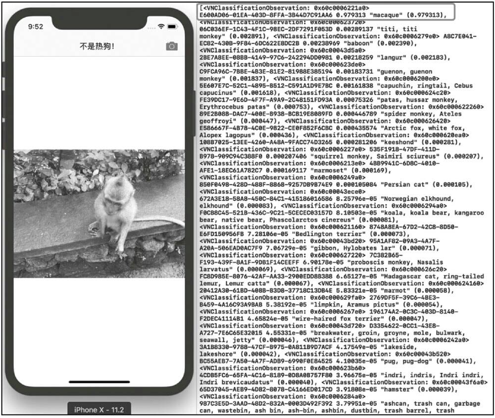

# 第15章 机器学习和Core-ML  

本章我们将学习一些令人激动的东西，这就是机器学习——Core-ML。通过苹果最新的机器学习框架，我们可以在应用程序开发中让我们的应用更加智能。在2017年6月WWDC开发者大会上，苹果发布了机器学习。那时我们非常兴奋，因为我们可以在很多的应用中使用Core-ML来实现很多有趣和实用的事情。本章先会向大家介绍什么是机器学习(Machine Learning)。如果你之前从来没有听说过机器学习，或者只是在某些场合听到过一两次“机器学习”这个名词，那么现在了解什么是机器学习是非常必要的；然后会向大家介绍当前可以使用的不同类型的机器学习，或者说是在真实应用中可以使用的机器学习；最后我们会通过实战练习会教给大家如何使用Core-ML在iOS中用Swift语言去实现可视化的识别。


## 15.1 介绍机器学习  
### 15.1.1 机器学习  
什么是机器学习呢？简单来说呢，它就是通过一大堆的学习，让计算机可以通过没有明确代码的方式进行学习。本书自始至终都是教大家如何使用Swift语言进行程序开发，执行指令的设备不是计算机而是iPhone或者iPad。我们用一些明确的指令告诉它们要做什么，比如我们之前所做的Quizzler项目的应用，只有在用户单击了正确答案以后，iPhone才会显示一个对勾，告诉用户他答对了。这里我们使用了条件判断语句。如果反过来，我们让计算机去回答这些问题，然后我们就像教自己的孩子一样，教会计算机这些知识哪些是对的，哪些是错的，通过不断地体验来积累它们的知识技能，这就是机器学习。  

我们再换一种说法，来解释什么是机器学习。就像是《星球大战》中的BB 8，我们想让它从起始的位置最终走到标有旗子的终点，如图15-1所示。  

   
图15-1 BB 8达到旗子终点示意图  

我们可以编写程序，让它先往前走，当遇到障碍物无法向前走的时候让它向右转，然后直达标旗目标。这是一个非常简单的程序代码脚本，而且效果非常好。但是，如果遮挡物移动到了其他位置，我们的程序代码就没有任何意义了，因为BB 8还是会按照原来的程序流程进行移动。当然你也可以让程序代码更加复杂一些，比如说你可以先确定终点的坐标，然后根据一些路由算法去找出最短路线，并最终到达终点；或者是当BB 8遇到障碍物的时候，让它向左或向右躲闪，最终到达终点，这也是完全可以的。  

但是利用机器学习，我们可以只是简单地告诉BB 8你需要到达标旗终点就可以了。在这一过程中，它可能会走一些弯路，也有可能会走出不同的线路。一旦它到达终点，我们就会告诉它：All right，你走到了目的地。随着时间的流逝，如果我们让BB 8保持这种不断的训练，它就会通过学习，来减少遇到遮挡物的次数，并找出最短的路由到达终点。而整个过程我们都不需要编写明确的代码，这就是机器学习的本质。  

所以在这里我们为机器学习所下的定义就是：使计算机能够在没有明确编程的情况下进行学习。说这句话的人叫亚瑟·塞缪尔，他是机器学习的先驱之一，他第一个编写了能够称之为机器学习的算法。他在不给计算机编写任何明确代码的情况下，让机器自己去尝试和学习如何下国际象棋，然后再不断地重复游戏并提高自己的下棋水平。  

机器学习通常被分为两个类别：一个是监督式学习，另一个是非监督式学习，这与我们要如何训练机器模型相关。

### 15.1.2 监督式学习  

监督式学习(Supervised Learning)，相当于你要手把手教计算机要学习的东西。一个最著名的例子就是教计算机如何识别一只猫。通过各种的猫的图片，如图15-2所示，我们会告诉计算机，哪个是一只猫。当然对于人类来说，识别一只猫是非常简单的事情，并且我们还会区分出图片上的动物若不是猫则是什么动物。  

   
图15-2 监督式学习各种各样的猫  

理解如何区分不同的动物的过程正是机器学习做的事情。我们为计算机提供了非常多的猫的图片，并且在提供图片的同时，还为它提供了一个标签(Label)，告诉它这张图片里的动物是猫。通过标签和图像的混合数据，机器便知道了这是一只猫。这也就是为什么在监督式机器学习中，所有训练样本都是带标签的。  

通过这样不断地学习，让机器了解到很多有关猫的特征，直到有一次我们只提供给计算机猫的一部分的图片，如图15-3所示，即使在没有标签的情况下，机器也能够识别出它是一只猫，因为这张图片包含了很多猫的特性，并与之前所提供猫的图片非常类似。  

   
图15-3 只有部分特征的猫  

在训练机器学习模型(Machine Learning Model)的时候，我们实际上会提供很多的图片，而且每张图片都会带有一个非常明确的标签。例如我们将一大堆狗的图片、一大堆猫的图片和一大堆奶牛的图片，都灌进机器学习模型之中。这几种动物都包含了不同的饲养方式、不同的大小和重量等苛刻的条件。机器通过之前的学习经验，开始去分类这些图片，把它们都放在独立的分组中，如图15-4所示。  

   
图15-4 机器模型学习示意图  

在这种情况下，模型就是机器中与学习相关的事情。你提供的图片就是训练样本。一旦我们完成了训练，再给机器提供一张训练样本中没有的图片，机器可以基于之前的学习，识别出这是一张狗的图片，并且最终拼写出答案——这是一只狗。在这里，我们管这张机器从来没有见过的图片叫测试数据，我们管输出的内容叫输出(output)。输出可以有各种形式，比如文字、在棋盘上所走的一步棋等。输出的结果依赖于我们如何训练模型，以及我们想要它做什么。这就会涉及监督式学习中一个最基本的概念—分类。  

对于分类，你可以想象这样一个场景：你想让计算机学习关于苹果和梨之间的不同。这对于人类来说是一件非常容易的事情。但是在程序中，我们必须要告诉计算机，在苹果和梨之间都有哪些不同。其实，这是一个非常复杂的问题，因为你需要让计算机将这两张图放大到可以看到每一个像素，一般来说，苹果图片趋向于更多的红色，而梨趋向于更多的绿色。但是如果我们又提供给计算机一个绿色的苹果，那么计算机可能就会基于之前的学习。把它标识为梨。所以说，我们需要用更多的代码去设置苹果的特性，比如我们会说苹果比梨更圆一些、更红一些等。你可以尝试着给计算机呈现一些它之前没有见过的东西，比如说桃，这相当于一种异常事件，因为它既不属于苹果，也不属于梨。计算机会使用我们之前所设定的规则，尝试着将它分类。  

这只是一个演示，即便是人，我们也很难准确分辨出所有事物。在人类整个学习过程中，就是要将苹果的唯一特征与其他水果区分开来。通过程序的规则列表去分类和识别这些图像，是非常困难且耗时较长的，比如让计算机去识别苹果和桃就更加的困难。  

有关机器学习模型有一件非常好的事情，就是可以复用它。我们可以创建一个泛型分类，将手写数字识别成整型数，也就是相当于OCR。同时你可以使用相同的范型分类，再次进行更深层次的训练。比如我们可以通过机器学习去识别邮件中的内容，从而判断这个邮件是垃圾邮件还是正常邮件。现在让我们看一下机器是如何做到的。  

我们可以创建这样一个图表。图表中有一条线代表临界值，如果电子邮件达到了临界值以上，该邮件就会进入垃圾邮件，否则会进入收件箱。这个临界值是如何生成的呢？我们会有一个垃圾的智能过滤程序，我们在训练这个模型的时候使用了大批的邮件，并且为这些邮件都提供了垃圾或者是非垃圾的标签。
比如说，我们判断一封邮件是否为垃圾邮件，就会查看其内容的链接是否过多。如果这封邮件里面包含了上百个链接，那么就可以判定它是垃圾邮件。如果我们按照这个规则绘制图表的话，它就应该如图15-5所示这个样子。  

   
图15-5 机器学习判断垃圾邮件  

机器学习模型的工作就是尝试着去绘制这样一条线，通过所提供的训练样本，找出链接是多少的这个临界点。比如说，这个邮件中的链接数少于5个，那它可能就是正常的邮件，我们将它放入收件箱。如果超过5个，那它有可能就是垃圾邮件，我们会把它放到垃圾箱。这只是分辨垃圾邮件时涉及的众多特性中的一个，我们还可以通过邮件内容中的图片数量或者是邮件中“销售”“购买”等关键字的数量来确定。这样的学习会持续很长的时间。在邮箱中，每一次被标记为垃圾的邮件，都相当于给了机器学习一次机会。机器还会根据新的数据或者新的特性，来增加判断的准确性。  

### 15.1.3 非监督式学习  

非监督式学习与监督学习的不同之处在于，事先没有任何的训练样本，而需要直接对数据进行建模。这听起来似乎有点不可思议，但是在我们自身认识世界的过程中有很多地方都用到了非监督式学习。  

比如我们去参观一个画展，我们对艺术一无所知，但是欣赏完多幅作品之后，我们也能把它们分成不同的派别，比如哪些画更朦胧一点，哪些画更写实一些。即使我们不知道什么叫朦胧派，什么叫写实派，但是至少我们能把它们分为两类。非监督式学习里典型的例子就是聚类(Clustering)了。聚类的目的在于把相似的东西聚在一起，而我们并不关心这一类是什么。因此，一个聚类算法通常只需要知道如何计算相似度就可以了。  

那么，什么时候应该采用监督式学习，什么时候应该采用非监督式学习呢？一种非常简单的回答就是从定义入手。如果我们在分类的过程中有训练样本(Training Data)，则可以考虑用监督式学习方法；如果没有训练样本，那就不可能用监督式学习了。但是事实上，我们在针对一个现实问题进行解答的过程中，即使没有现成的训练样本，我们也能够凭借自己的双眼，从待分类的数据中人工标注一些样本，并把它们作为训练样本，这样的话就可以用监督式学习的方法来做了。  

### 15.1.4 强化学习  

本节我们来说说强化学习。  

如果我们在使用烤箱烘焙食物的时候，用手指触碰了里面非常热的东西，这个时候我们就会被灼伤，在未来的一段时间，我们就不会再触碰它了。因为疼痛的灼伤感，强化了我们对这个操作的记忆。但是这种记忆方式是比较残酷的，这可能导致我们自身受到很多的伤害，因此像这种负能量的学习是不可取的，如图15-6所示。  

   
图15-6 不可取的强化学习  

我们使用更多的强化学习方式是正向奖赏，例如我们训练一只狗，让它按照我们的要求做出某些动作，当我们在给狗下达“坐下”指令以后，它按照要求坐下，我们就会给它一定的奖赏，让它知道，自己做了一件正确的事情。这就是强化学习。  

在强化学习中，一个最具代表性的应用就是下棋。如图15-7所示，假设棋盘左方的选手是使用了强化学习算法的机器。它会持续地去计算下棋期间赢的可能性。如果它实际走一步棋，并且这一步棋增加了赢的可能性，那么这就是正向强化。如果对手此时进行了有效还击，并减少了机器赢的可能性，这就是负向强化。机器通过与人下非常多的棋，并通过非常多的训练周期，就能够学到如何下每一步棋，从而让机器赢的可能性增加。现在世界上最著名的强化学习的应用程序就是谷歌的AlphaGo。  

   
图15-7 最著名的强化学习应用程序——AlphaGO  

## 15.2 Core-ML——整合机器学习到iOS应用中  

为了完成后面的实战练习，我们需要Xcode 9和安装了iOS 11的物理真机。  

### 15.2.1 什么是Core-ML?  
现在我们来说说如何使用机器学习。该是Core-ML大显身手的时候了。首先我们要弄清楚什么是Core-ML，实际上它允许我们做两件事情，从而在iOS项目中，可以很容易地整合机器学习。  

第一件事情就是允许我们载入一个预先训练好的机器学习模型，它包含一个简单的可转换我们之前训练模型的方式。我们可以将这个模型转换为一个类，让这个类在Xcode中使用，如图15-8所示。  

   
图15-8 Core-ML示意图  

我们将会把预先训练好的数据模型转换到．mlmodel文件之中，它是一个完全的开放的文件格式，并且包含了所有的输入输出。
第二件事情就是，Core-ML允许你去做一个断言(Predication)，这样的话就可以将模型载入本地的iOS设备上。一旦用户下载并使用了你的应用程序，它就能使用模型去做断言，比如图像识别、语音识别或者是其他任何训练模型。  

通过浏览器可以访问[https://developer.apple.com/machine-learning/](https://developer.apple.com/machine-learning/)网址，以了解苹果关于机器学习的内容。它包括概述、如何在iOS中使用机器学习。网页中最有趣的部分是模型的下载，这里面提供了已经训练好的“即插即用”的模型，如图15-9所示。  

   
图15-9 Apple提供的机器学习模型

我们在项目中将会使用谷歌的Inception v3模型。它能够检测出一千种物体，比如树木、动物、食物、车辆、人员等，它是通过大量的图片训练出来的模型。我们会使用它来识别在App中通过手机的摄像头所拍摄出来的图片。另外，我们还会检测一个图片，看图片中的东西是否为热狗。
在WWDC大会上，苹果宣布了通过Core-ML能够做很多的事情。它能够尽可能详细地进行分类。另外，在绝大多数情况下，我们所实现的机器学习，仅仅是使用它来分类。  

但我们应明白Core-ML不能做什么。我们不能使用自己的应用生成的那些数据样本来训练机器。当我们安装了一个提前训练好的模型时，它就相当于一个静态模型。在大多数情况下，这个模型会被放置在一个工作区里边，它只是放在那里。目前，还没有任何的方法能够让用户使用自己在App中生成的数据去训练数据模型。还有就是Core-ML不加密，如果你使用了一个专利数据模型，或者是模型中包含了敏感的数据，你就要知道这
这些都是不加密的。虽然Core-ML有上述的这些限制，但是它所做的事情还是足够令我们兴奋，我们甚至可以在不了解什么是机器学习的情况下，使用一些简单的代码做出令人不可思议的事情。  

目前在App Store中，典型的与机器学习相关的应用有Garden Answers Plant Id，其可通过为植物的花和叶子拍照识别出该植物，如图15-10所示。  

   
图15-10 使用到Core-ML的应用  

### 15.2.2 Core-ML能做什么  
本节我们会制作一个识别热狗的应用程序，在应用中我们会调用摄像头来拍摄照片，然后通过Core-ML来将其分类，并判断它是否为热狗。  

- 实战：搭建图像识别应用的构架。  

步骤1：在Xcode中创建一个新的Single View App项目，将Product Name设置为SeeFood。  

步骤2：在之前提到的苹果网站中下载Model到本地，选择Inception V3，因为它的识别分类效果是目前最好的。将下载好的Inceptionv3.mlmodel文件拖曳到Xcode项目之中，确认勾选了Copy items if needed，单击Finish按钮。  

一旦我们将Inceptionv3.mlmodel文件添加到项目之中，在项目导航中单击该文件以后，在编辑窗口中我们就可以看到Xcode已经为该模型创建了一个Model Class，如图15-11所示。  

   
图15-11 将Inceptionv3.mlmodel文件添加到项目中  

单击Model Class中Inceptionv3右侧的箭头，就可以看到类的相关代码。接下来，我们需要编写一些代码将模型整合到视图控制器中。  

步骤3：在ViewController.swift文件中，导入两个框架。  
```swift  
import CoreML
import Vision
```
vision框架可以帮助我们更简单地处理图像，其允许我们让图像在Core-ML中工作，并且免去编写一大堆的代码的麻烦。  

- 实战：通过照片获取器在应用中拍照。  

使用UIImagePicker类可以让我们通过摄像头拍照并选择照片进行识别，整个过程非常简单。  

步骤1：在ViewController类的声明中添加UIImagePickerControllerDelegate协议。
```swift
class ViewController: UIViewController,  UIImagePickerControllerDelegate,UINavigationControllerDelegate {
```  

在使用UIImagePickerControllerDelegate协议的时候，我们必须实现UINavigation-ControllerDelegate协议，它们是依赖关系。  

步骤2：在故事板中选择ViewController视图，然后在菜单中选择Editor/Embed In/Navigation Controller，让当前的控制器内置于一个导航控制器之中，如图15-12所示。  

   
图15-12 内嵌导航控制器  

此时会有一个导航栏位于视图的顶部，这样就可以通过导航来控制控制器之间的切换了。  

步骤3：在对象库中找到Bar Button Item对象，将其添加到ViewController视图导航栏的右侧。在Attributes Inspector中将System Item设置为Camera，如图15-13所示。  

   
图15-13 设置Bar Button Item  

步骤4：在对象库中将Image View添加到ViewController视图，该控件用于显示摄像头所拍摄的，或者是从iPhone照片库选择的图像。设置其大小占满控制器整个视图空间(除导航栏)，并设置它的约束在四个方向上均为0(代表紧密贴合屏幕的三个边和上边的导航栏)，如图15-14所示。  

    
图15-14 创建必要的约束  

步骤5：将之前的拍照按钮与ViewController类建立IBAction关联。将Image View与ViewController类建立IBOutlet关联。  
```swift
@IBOutlet weak var imageView: UIImageView!

@IBAction func cameraTapped(_ sender: UIBarButtonItem) {
}
```  

步骤6：在ViewController类中添加一个新的属性。  
```swift
let imagePicker = UIImagePickerController()

override func viewDidLoad() {
  super.viewDidLoad()

  imagePicker.delegate = self
  imagePicker.sourceType = .camera
  imagePicker.allowsEditing = false
}
```  

这里创建的imagePicker对象就是iOS中的照片获取器。为了可以在用户选择照片以后通知到ViewController类，在viewDidLoad()方法中，需要设置其delegate属性指向当前类。  

sourceType属性用于指定照片获取器通过什么渠道获取照片，这里设置为摄像头。allowsEditing属性是一个布尔型值，用于指定是否允许用户编辑选中的照片或视频。你可能想开启它，因为这样可以让用户裁剪照片，让机器学习更少的区域，从而更有针对性地进行识别。这里我们暂时将它设置为false，即不激活该功能。  
  
接下来，我们需要在用户单击导航栏的摄像头图标的时候调出照片获取器。  

步骤7：在cameraTapped()方法中添加下面的代码。  
```swift
@IBAction func cameraTapped(_ sender: UIBarButtonItem) {
  present(imagePicker, animated: true, completion: nil)
}
```  
通过present()方法，将UIImagePickerController对象以动画的方式呈现到屏幕上，在呈现完成以后不会执行任何代码。  

下面，我们要通过照片获取器来得到照片，并通过机器学习进行识别。  

- 实战：获取照片以后通过机器学习识别。  

步骤1：在ViewController类中添加下面的方法。  
```swift
func imagePickerController(_ picker: UIImagePickerController,didFinishPickingMediaWithInfo info: [String: Any]) {
  let userPickedImage = info[UIImagePickerControllerOriginalImage]
  imageView.image = userPickedImage
}
```

当用户从照片获取器中成功取图像以后会调用该方法，它带有2个参数：picker指明的是该方法来自于哪个UIImagePickerController对象的调用，当前是来自于imagePicker对象；参数info是字典类型格式，在该字典中，包含了用户所选择的图像。  

在方法内部，首先通过info字典获取用户选择的图像，因为info是字典，所以需要通过键获取UIImage类型的图像，这个键名就是iOS SDK预定义好的UIImagePickerControllerOriginalImage，代表用户所选择的图像原始图。  

因为在方法中info字典的类型为[String : Any]，所以从info字典得到的值的类型为Any?，在将userPickedImage赋值给imageView的image属性的时候，编译器会报错Cannot assign value of type 'Any?' to type 'UIImage?'，即不能将Any？类型赋值给UIImage？类型。  

步骤2：将之前方法中的代码修改为下面这样。  
```swift
func imagePickerController(_ picker: UIImagePickerController,didFinishPickingMediaWithInfo info: [String : Any]) {
  if let userPickedImage = info[UIImagePickerControllerOriginalImage] as? UIImage {
    imageView.image = userPickedImage
  }
  imagePicker.dismiss(animated: true, completion: nil)
}
```
**修正版**
```swift
func imagePickerController(_ picker: UIImagePickerController, didFinishPickingMediaWithInfo info: [UIImagePickerController.InfoKey : Any]) {
    print("imagePickerController call")
    if let userPickedImage = info[.originalImage] as? UIImage {
        imageView.image = userPickedImage

        guard let ciimage = CIImage(image: userPickedImage) else {
            fatalError("无法转换图像到CIImage")
        }
        // 调用图像识别
        detect(image: ciimage)
    }

    imagePicker.dismiss(animated: true, completion: nil)
}
```

这里，使用可选绑定方式，如果info[UIImagePickerControllerOriginalImage]的值存在，则将其转换为可选UIImage类型，然后赋值给userPickedImage常量。如果有值，则再将userPickedImage赋值给imageView的image属性。这样既增加了代码的可读性，又使代码更加安全，所有的错误都消失了。  

在方法的最后，我们使用dismiss()方法销毁照片获取器。  

因为在项目中使用了摄像头，所以需要运行在真机上面。但是在构建并运行项目的时候，应用程序会发生崩溃，从控制台可以看出是这因为reason: 'Source type 1 not available'。因为我们所运行的项目试图访问一个敏感数据而没有使用描述。  

步骤3：打开info.plist文件，添加新的属性Privacy - Camera Usage Description，然后将值设置为：当前的应用程序需要使用你的摄像头。

- 提示  

如果你想让应用程序可以访问用户的照片库，则需要设置Privacy - Photo Library Usage Description属性。  

再次构建并运行项目，可以看到在使用摄像头的时候会让用户选择是否允许使用摄像头或访问照片库。  

- 技巧  

如果将imagePicker的sourceType属性修改为．photoLibrary，则可以在模拟器中打开该项目，然后通过照片库来载入图像。  

### 15.2.3 如何识别图像并反馈结果  
本节我们开始在项目中使用模型，将Inception V3机器学习模型整合到项目之中，并对相关的操作做出一定的解释。  
- 实战：为项目添加图像识别功能。  

步骤1：将从imagePicker中获取的UIImage类型的图像转换为CIImage类型。  
```swift
func imagePickerController(_ picker: UIImagePickerController,didFinishPickingMediaWithInfo info: [String : Any]) {
  if let userPickedImage = info[UIImagePickerControllerOriginalImage] as? UIImage {
    imageView.image = userPickedImage

    guard let ciimage = CIImage(image: userPickedImage) else {
      fatalError("无法转换图像到CIImage")
    }

    detect(image: ciimage)
  }
  imagePicker.dismiss(animated: true, completion: nil)
}
```  

这里我们需要将从照片获取器得到的UIImage对象转换为CIImage对象，因为它是标准的Core Image图像，而且在使用Vision和Core-ML框架中的方法时，必须要用这种特定类型。  

如果我们只是通过let ciimage = CIImage(image: userPickedImage)语句赋值一个ciimage常量，虽然运行没有任何问题，但是我们希望可以为代码添加一些安全特性，让代码的运行更加安全。  

通过guard …… else { …… }语句，如果guard后面的代码运行失败，则会执行else中的代码。在当前的情况下，如果不能将userPickedImage转换为CIImage类型的对象，则会激活一个致命错误，并提示：无法转换图像到CIImage，程序终止运行。  

接下来，我们需要处理这个CIImage对象，并获取图像的解读信息或分类。  

步骤2：在ViewController类中添加一个方法。  
```swift
func detect(image: CIImage) {
  guard let model = try? VNCoreMLModel(for: Inceptionv3().model) else {
    fatalError("载入CoreML模型失败")
  }

  let request = VNCoreMLRequest(model: model) { (request, error) in
    guard let results = request.results as? [VNClassificationObservation] else {
      fatalError("模型处理图像失败")
    }

  print(results)
}
```  

detect()方法带有一个CIImage参数，在方法体中我们将使用Inception V3模型。我们通过VNCoreMLModel类创建一个model常量，并将Inception V3作为该对象的机器学习模型。之后，我们会使用Inception V3对图像进行分类。   

如果在代码中我们按let model = VNCoreMLModel(for: Inceptionv3().model)这样编写，编译器会报错：VNCoreMLModel()方法有一个抛出(throw)，但是还没有标记try关键字和相应的错误处理代码。  

因为VNCoreMLModel()方法会在初始化失败的时候抛出带有错误描述的异常，所以我们需要使用try关键字去尝试执行后面的代码。如果代码执行成功，则将其封装到一个可选常量里面。如果执行失败就会抛出错误，然后model就会被赋值为nil。  

在这种情况下，我们再次使用guard关键字，在model的值为nil的情况下，就会运行else中的代码。  

接下来，我们需要实现一个图形分析请求，这样才能通过Core-ML模型去处理图像。通过VNCoreMLRequest()创建一个请求，其第一个参数model代表我们所使用的模型，第二个是完成处理的闭包参数，代表请求执行完毕后要做的事情。在闭包内部，通过request的results属性，我们可以得到图像的分析处理结果，该结果是VNClassificationObservation类型的数组。如果results获取失败则会执行fatalError()方法。  

在方法的最后，我们直接打印结果到控制台。  

步骤3：在let request =语句的下面，添加下面两行代码。  
```swift
let request = VNCoreMLRequest(model: model) { (request, error) in
  ……
}

let handler = VNImageRequestHandler(ciImage: image)
try! handler.perform([request])
```  
将之前转换好的CIImage对象作为VNImageRequestHandler对象的参数输入到模型中。最后，在handler中执行之前生成的请求。注意，请求是以数组的形式作为参数的，这代表我们可以同时执行多个请求。这里直接使用try！代表handler的perform()方法不会出现任何的问题，强制执行这个方法。  

步骤4：在imagePickerController(_ picker: UIImagePickerController, didFinishPicking-Media WithInfo info: [String : Any])方法中添加对detect(image: CIImage)方法的调用。  
```swift
func imagePickerController(_ picker: UIImagePickerController,didFinishPickingMediaWithInfo info: [String : Any]) {
  if let userPickedImage = info[UIImagePickerControllerOriginalImage] as? UIImage {
    imageView.image = userPickedImage

    guard let ciimage = CIImage(image: userPickedImage) else {
      fatalError("无法转换图像到CIImage")
    }
    // 调用图像识别
detect(image: ciimage)
  }
  imagePicker.dismiss(animated: true, completion: nil)
}
```
构建并运行项目，在真机上面使用该应用拍照后，可以在控制台中看到大量的输出信息，如图15-15所示。其中排在输出第一位的就是相似度最高的名称。在当前的照片中，与猕猴(macaque)有97.9313%相似度，接下来的其他名称相似度就少得可怜了。是不是觉得很神奇呢？  

   
图15-15 机器学习分析后的结果  

### 15.2.4 判断图片中的食物  

本节我们将会实现通过照片获取器判断图像中的内容是否为“热狗”，或者是其他任何指定的东西。  

在detect(image: CIImage)方法中，我们首先导入Inception V3模型并创建请求(request)，然后要求模型去识别和分类任何数据。在处理数据完成以后，执行VNCoreMLRequest的回调闭包。目前我们只是将分类信息打印到控制台。  

接下来我们需要做的就是从结果中判断图像中是否为热狗，也就是相似度最高的是否为热狗。通过之前在控制台打印出的信息，我们可以看到数组形式的VNClassi-ficationObservation对象。我们需要获取其中的第一个元素。  

- 实战：识别图像是否为热狗。  

修改detect(image: CIImage)方法中的闭包代码。  
```swift
let request = VNCoreMLRequest(model: model) { (request, error) in
	guard let results = request.results as? [VNClassificationObservation] else {
		fatalError("模型处理图像失败")
	}
	
	//print(results)
	if let firstResult = results.first {
		if firstResult.identifier.contains("hotdog") {
		  self.navigationItem.title = "热狗！"
		}else {
		  self.navigationItem.title = "不是热狗
		}
	}
}
```
这里先注释掉之前的打印语句，然后获取数组中的第一个元素，它是VNClassification-Observation类型的对象。注意，第一个元素所提供的信息是相似度最高的。通过contains()方法，我们可以判断VNClassificationObservation的identifier属性中是否包含dumplings字符串。如果包含，则让导航栏的标题部分显示热狗，否则显示不是热狗。  

构建并运行项目，通过照片获取器取得一张照片，代码会自动分析该照片是否为热狗，并将结果显示到导航栏中，如图15-16所示。  

   
图15-16 机器学习分析图片是否为热狗


